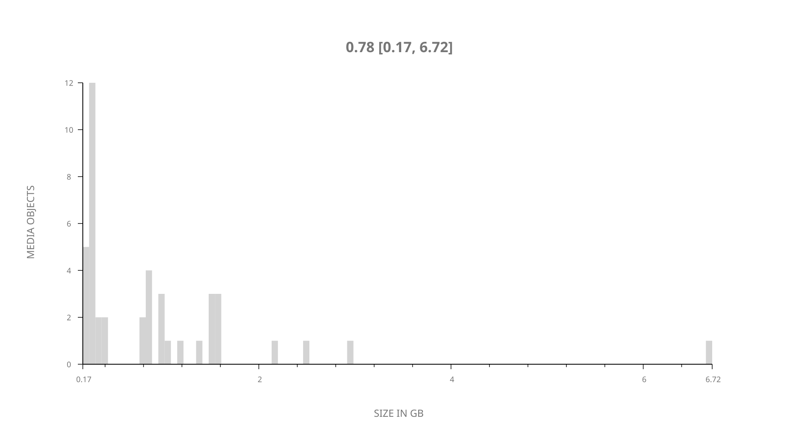
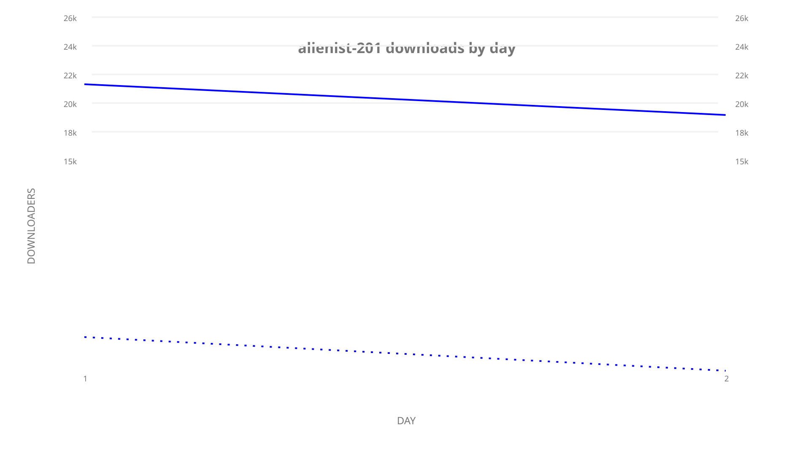
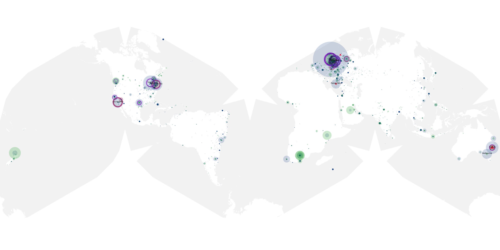
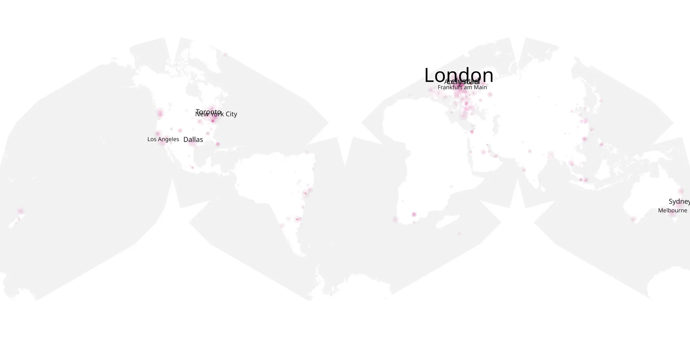
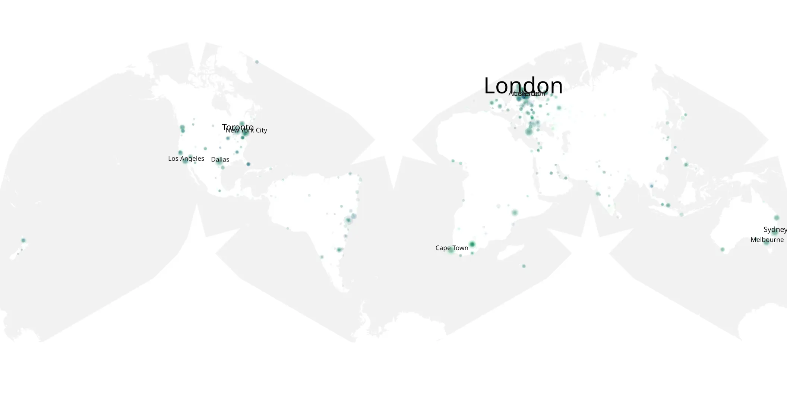

# alienist-201 sample cache audit

## 1. Media object

| Field | Value |
| --- | --- |
| Media object | The Alienist: Angel of Darkness |
| Collection key | `alienist-201` |
| imdb_id | [tt4604612](https://www.imdb.com/title/tt4604612/) |
| wikipedia_url | [The Alienist (TV series)](https://en.wikipedia.org/wiki/The_Alienist_(TV_series)) |
| Sample dates | 2020-07-20-to-2020-07-21 |
| Sample days | 2 |
| BTIH count | 43 |
| Unique BTIH count | 43 |
| Downloaders total | 60,541 |
| Uploaders total | 28,906 |
| Data version | `2026-08-05` |
| IP geolocation version | `6:1777968300` |

## 2. Sample coverage report

- Generated: 2026-09-10T15:44:01Z
- Sample archive directory: `/mnt/gold/src/alpha60-samples-raw.gold/alienist-201.xz`
- Hour directories: 42
- Zero-length sample files: 0
- Other unparsable sample files: 0
- Hourly discontinuities: 0 (0 missing hours)
- Missing days: 0

### Sample archive discontinuities

None detected.

## 3. Media objects file size histogram

## 4. Visualization pass — graphs

### Downloads by week cumulative (normalized start)



### Downloads by day, Saturday and Sunday in gray

## 5. Visualization pass — maps

### Cumulative geographic slices

| Africa | Americas | Asia | Europe | Oceania | Unknown |
| --- | --- | --- | --- | --- | --- |
| 5.22 | 28.35 | 9.93 | 35.68 | 5.53 | 0.43 |

### Cumulative network infrastructure

{:target="_blank" rel="noopener"}

### Cumulative data maps

**Cumulative >= 1080p**

{:target="_blank" rel="noopener"}

**Cumulative < 1080p**

{:target="_blank" rel="noopener"}
