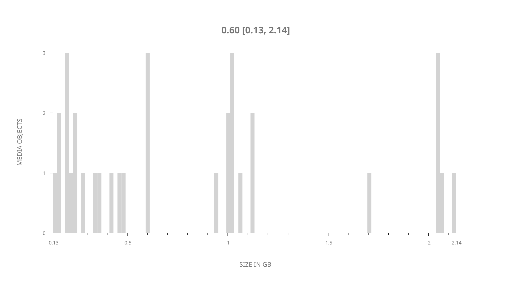
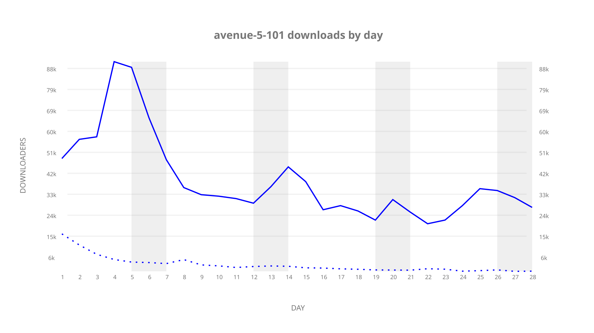
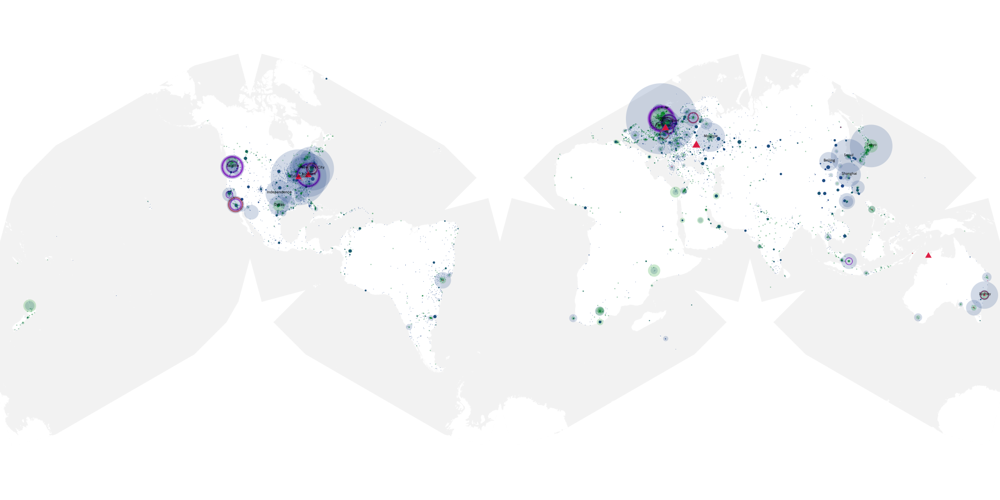
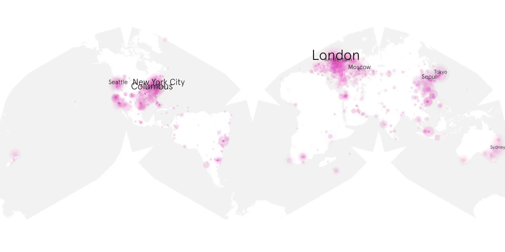
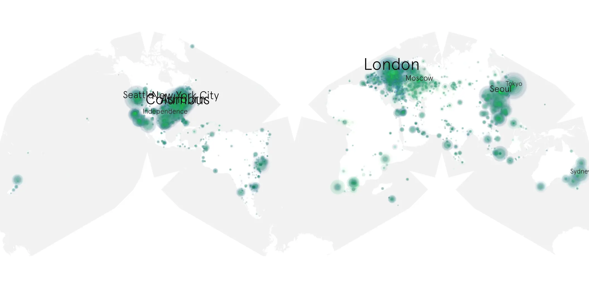

# avenue-5-101 sample cache audit

## 1. Media object

| Field | Value |
| --- | --- |
| Media object | Avenue 5 |
| Collection key | `avenue-5-101` |
| imdb_id | [tt10234362](https://www.imdb.com/title/tt10234362/) |
| wikipedia_url | [Avenue 5](https://en.wikipedia.org/wiki/Avenue_5) |
| Sample dates | 2020-01-20-to-2020-02-16 |
| Sample days | 28 |
| BTIH count | 37 |
| Unique BTIH count | 33 |
| Downloaders total | 844,878 |
| Uploaders total | 118,440 |
| Data version | `2026-08-05` |
| IP geolocation version | `6:1777968300` |

## 2. Coverage report

- Generated: 2026-09-04T03:20:38Z
- Evidence: read-only Day-member stream of the selected cache archive; no raw sample contents were opened
- Required sample span: 2020-01-20 to 2020-02-16 (28 days)
- Cache Day products: 28
- Sparse Day indices: 0
- Post-release Day products: 0

### Sample archive discontinuities

None detected.

## 3. File sizes histogram *median[lowest, highest]*

## 4. Graphs

### Downloads by week cumulative (normalized start)



### Downloads by day, Saturday and Sunday in gray

## 5. Cumulative Maps

<!-- https://raw.githubusercontent.com/alpha60-devops/alpha60-results-2020/refs/heads/main/data/ -->

### <a href="https://raw.githubusercontent.com/alpha60-devops/alpha60-results-2020/refs/heads/main/data/geojson.cumulative/avenue-5-101-cumulative-aggregate.geojson.gz" data-map-title="Avenue 5 — avenue-5-101" onclick="leaflet_map_open_window(this.href, this.dataset.mapTitle); return false;" class="table-link" aria-label="Open Avenue 5 (avenue-5-101) cumulative data map in new window" title="Opens interactive map for Avenue 5 (avenue-5-101) data">Swarm Detail</a>

### Geographic Regions

| Africa | Americas | Asia | Europe | Oceania | Unknown |
| --- | --- | --- | --- | --- | --- |
| 2.83 | 33.53 | 16.64 | 27.20 | 3.04 | 8.74 |

### Network infrastructure

{:target="_blank" rel="noopener"}

### Resolution >= 1080p

{:target="_blank" rel="noopener"}

### Resolution < 1080p

{:target="_blank" rel="noopener"}
