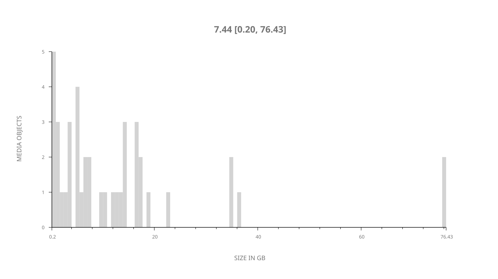
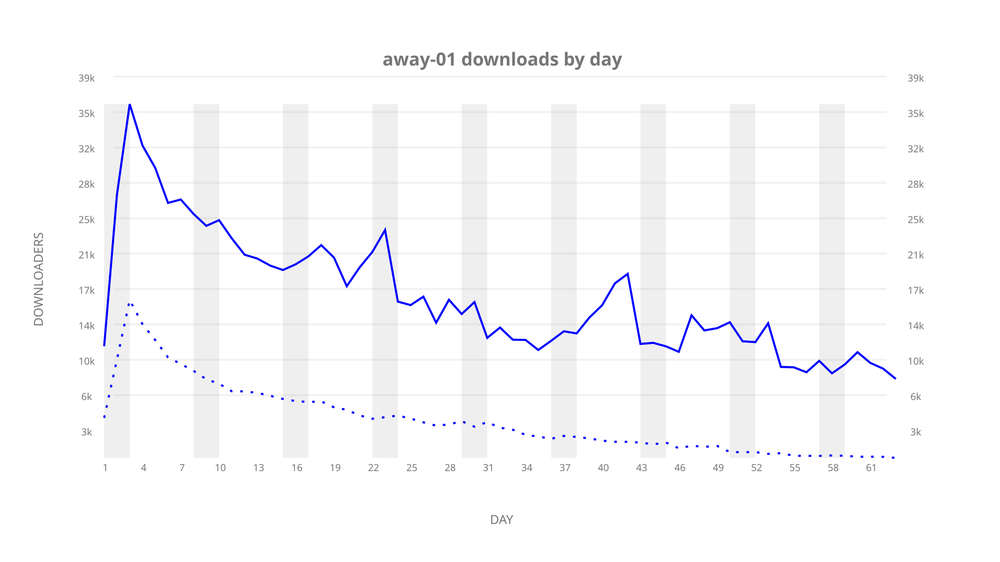
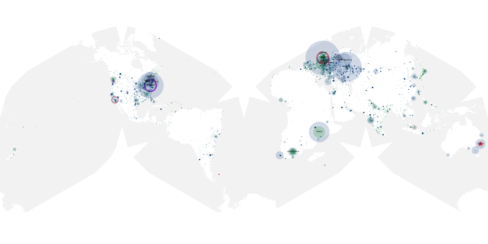
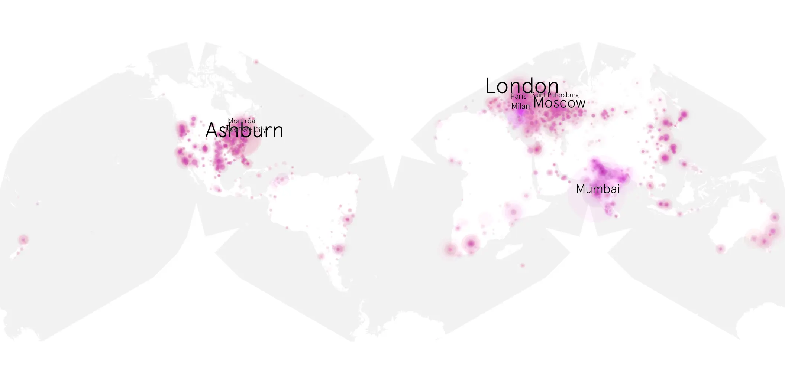
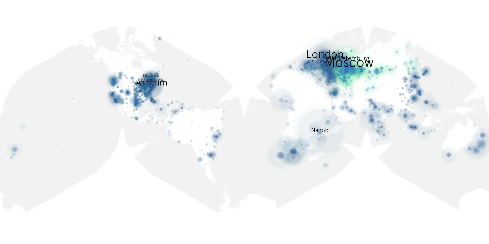

# away-01 sample cache audit

## 1. Media object

| Field | Value |
| --- | --- |
| Media object | Away |
| Collection key | `away-01` |
| imdb_id | [tt8787802](https://www.imdb.com/title/tt8787802/) |
| wikipedia_url | [Away (TV series)](https://en.wikipedia.org/wiki/Away_(TV_series)) |
| Sample dates | 2020-09-04-to-2020-11-12 |
| Sample days | 70 |
| BTIH count | 67 |
| Unique BTIH count | 42 |
| Downloaders total | 985,340 |
| Uploaders total | 301,295 |
| Data version | `2026-08-05` |
| IP geolocation version | `6:1777968300` |

## 2. Sample coverage report

- Generated: 2026-09-04T03:20:38Z
- Evidence: read-only Day-member stream of the selected cache archive; no raw sample contents were opened
- Required sample span: 2020-09-04 to 2020-11-12 (70 days)
- Cache Day products: 63
- Sparse Day indices: 7
- Post-release Day products: 0

### Sample archive discontinuities

- missing Day index 50: `2020-10-23`
- missing Day index 51: `2020-10-24`
- missing Day index 52: `2020-10-25`
- missing Day index 53: `2020-10-26`
- missing Day index 54: `2020-10-27`
- missing Day index 55: `2020-10-28`
- missing Day index 56: `2020-10-29`

## 3. Media objects file size histogram

## 4. Visualization pass — graphs

### Downloads by week cumulative (normalized start)



### Downloads by day, Saturday and Sunday in gray

## 5. Visualization pass — maps

### Cumulative geographic slices

| Africa | Americas | Asia | Europe | Oceania | Unknown |
| --- | --- | --- | --- | --- | --- |
| 4.15 | 29.86 | 11.71 | 36.55 | 2.09 | 0.98 |

### Cumulative network infrastructure

{:target="_blank" rel="noopener"}

### Cumulative data maps

**Cumulative >= 1080p**

{:target="_blank" rel="noopener"}

**Cumulative < 1080p**

{:target="_blank" rel="noopener"}
