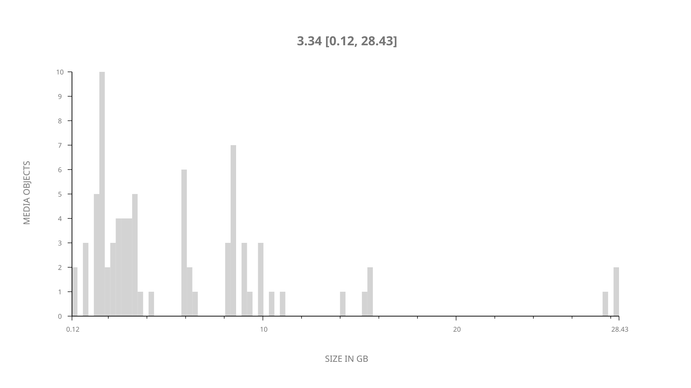
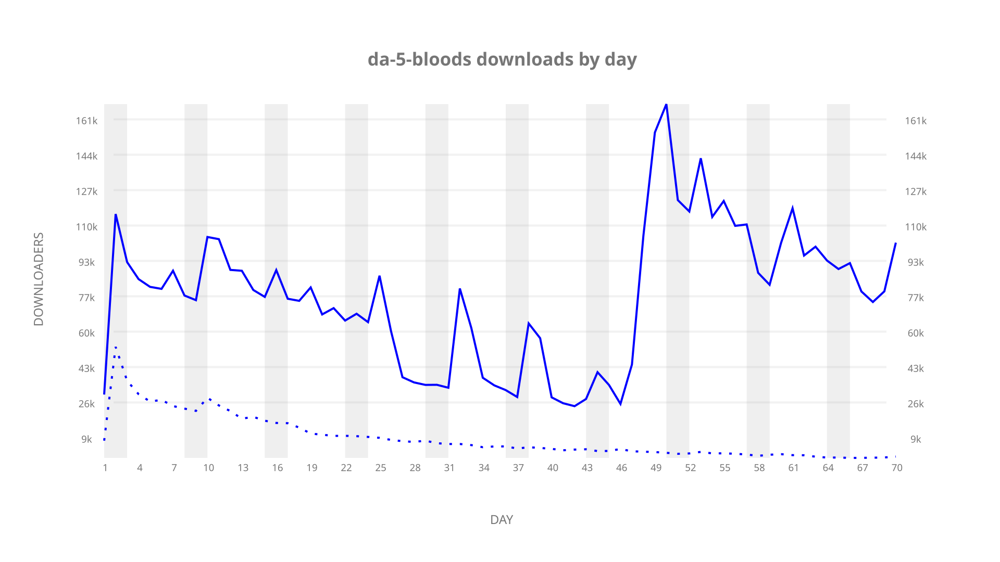
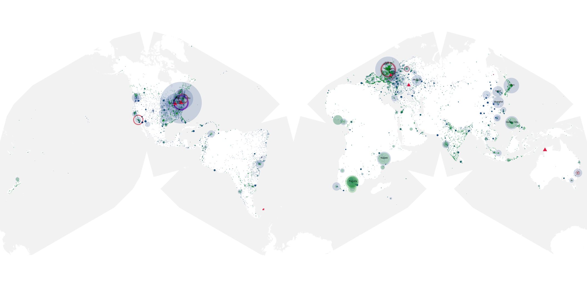
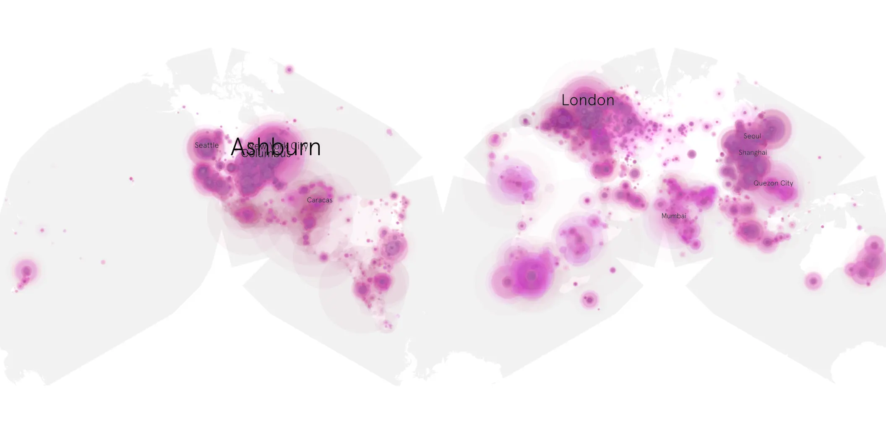
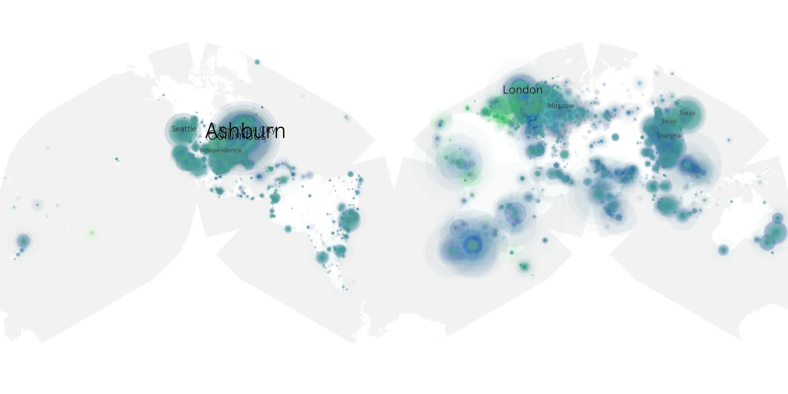

# da-5-bloods sample cache audit

## 1. Media object

| Field | Value |
| --- | --- |
| Media object | Da 5 Bloods |
| Collection key | `da-5-bloods` |
| imdb_id | [tt9777644](https://www.imdb.com/title/tt9777644/) |
| wikipedia_url | [Da 5 Bloods](https://en.wikipedia.org/wiki/Da_5_Bloods) |
| Sample dates | 2020-06-12-to-2020-08-20 |
| Sample days | 70 |
| BTIH count | 109 |
| Unique BTIH count | 79 |
| Downloaders total | 4,666,627 |
| Uploaders total | 961,442 |
| Data version | `2026-08-05` |
| IP geolocation version | `6:1777968300` |

## 2. Sample coverage report

- Generated: 2026-09-04T03:20:38Z
- Evidence: read-only Day-member stream of the selected cache archive; no raw sample contents were opened
- Required sample span: 2020-06-12 to 2020-08-20 (70 days)
- Cache Day products: 70
- Sparse Day indices: 0
- Post-release Day products: 0

### Sample archive discontinuities

None detected.

## 3. Media objects file size histogram

## 4. Visualization pass — graphs

### Downloads by week cumulative (normalized start)



### Downloads by day, Saturday and Sunday in gray

## 5. Visualization pass — maps

### Cumulative geographic slices

| Africa | Americas | Asia | Europe | Oceania | Unknown |
| --- | --- | --- | --- | --- | --- |
| 8.29 | 35.28 | 18.98 | 22.09 | 1.78 | 6.38 |

### Cumulative network infrastructure

{:target="_blank" rel="noopener"}

### Cumulative data maps

**Cumulative >= 1080p**

{:target="_blank" rel="noopener"}

**Cumulative < 1080p**

{:target="_blank" rel="noopener"}
