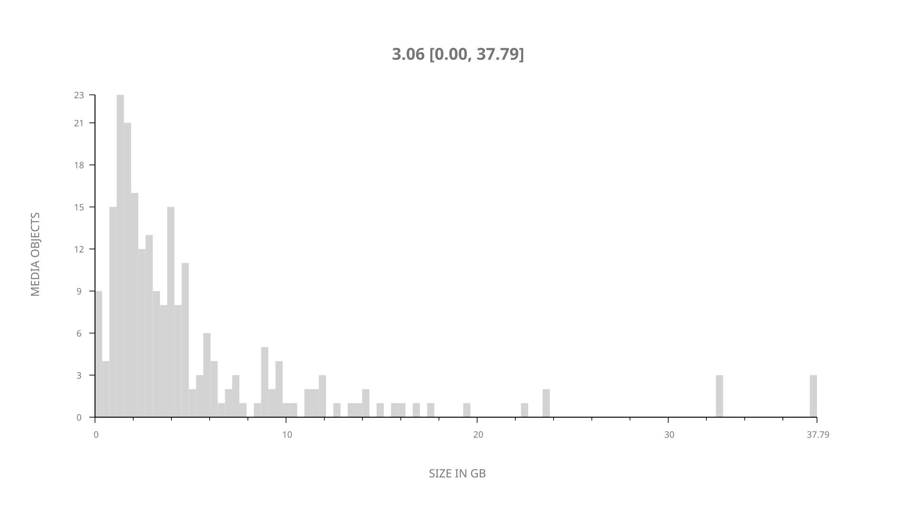
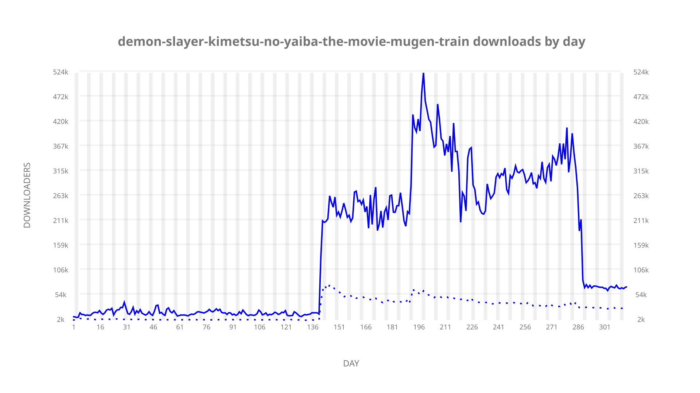
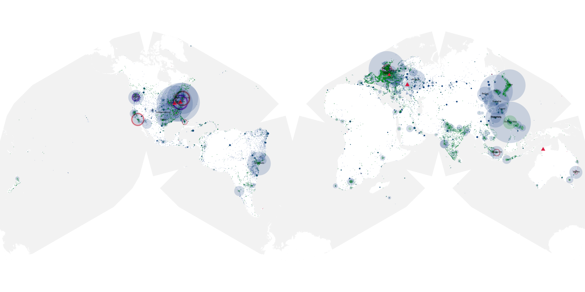
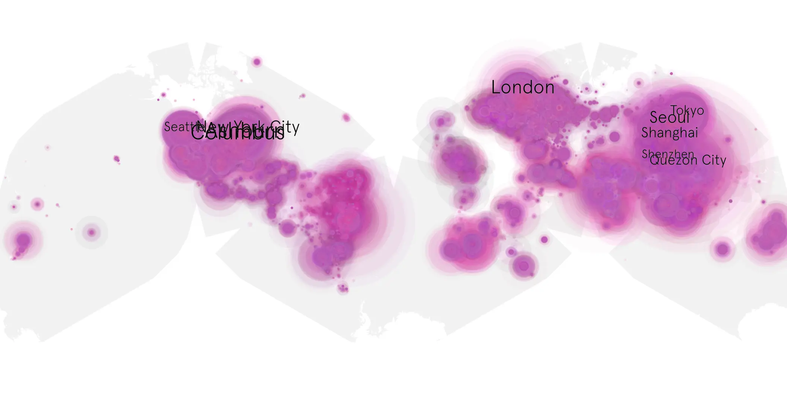
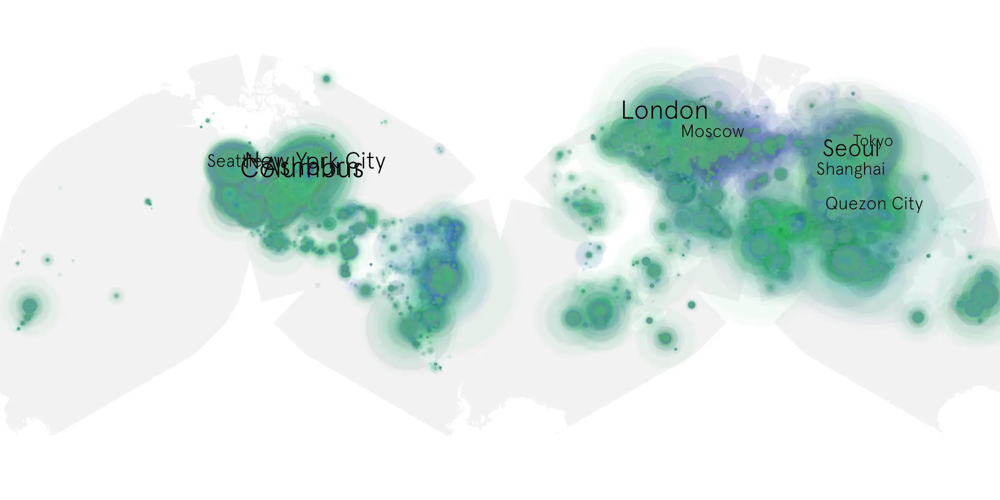

# demon-slayer-kimetsu-no-yaiba-the-movie-mugen-train sample cache audit

## 1. Media object

| Field | Value |
| --- | --- |
| Media object | Demon Slayer Kimetsu No Yaiba The Movie Mugen Train |
| Collection key | `demon-slayer-kimetsu-no-yaiba-the-movie-mugen-train` |
| imdb_id | [tt11032374](https://www.imdb.com/title/tt11032374/) |
| wikipedia_url | [Demon Slayer: Kimetsu no Yaiba – The Movie: Mugen Train](https://en.wikipedia.org/wiki/Demon_Slayer:_Kimetsu_no_Yaiba_%E2%80%93_The_Movie:_Mugen_Train) |
| Sample dates | 2020-12-10-to-2021-10-19 |
| Sample days | 314 |
| BTIH count | 302 |
| Unique BTIH count | 227 |
| Downloaders total | 28,028,436 |
| Uploaders total | 5,357,791 |
| Data version | `2026-08-05` |
| IP geolocation version | `6:1777968300` |

## 2. Sample coverage report

- Generated: 2026-09-04T03:20:38Z
- Evidence: read-only Day-member stream of the selected cache archive; no raw sample contents were opened
- Required sample span: 2020-12-10 to 2021-10-19 (314 days)
- Cache Day products: 314
- Sparse Day indices: 0
- Post-release Day products: 0

### Sample archive discontinuities

None detected.

## 3. Media objects file size histogram

## 4. Visualization pass — graphs

### Downloads by week cumulative (normalized start)



### Downloads by day, Saturday and Sunday in gray

## 5. Visualization pass — maps

### Cumulative geographic slices

| Africa | Americas | Asia | Europe | Oceania | Unknown |
| --- | --- | --- | --- | --- | --- |
| 4.35 | 34.11 | 27.84 | 21.18 | 1.55 | 7.57 |

### Cumulative network infrastructure

{:target="_blank" rel="noopener"}

### Cumulative data maps

**Cumulative >= 1080p**

{:target="_blank" rel="noopener"}

**Cumulative < 1080p**

{:target="_blank" rel="noopener"}
