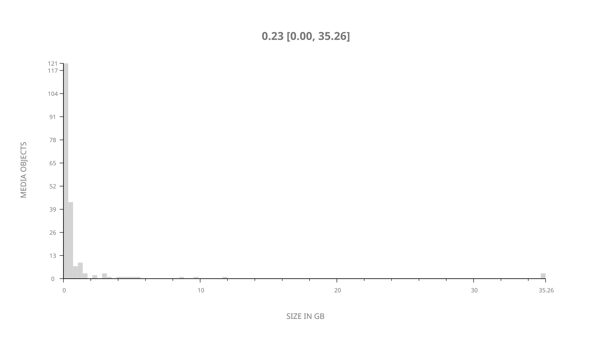
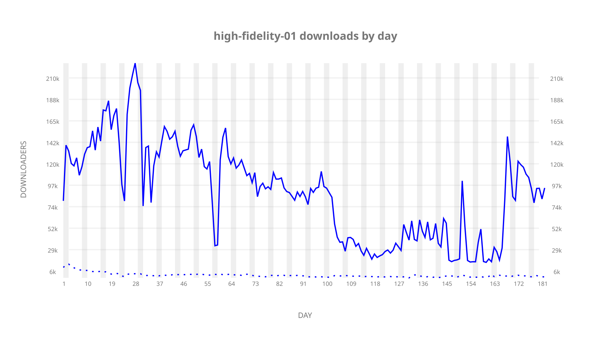
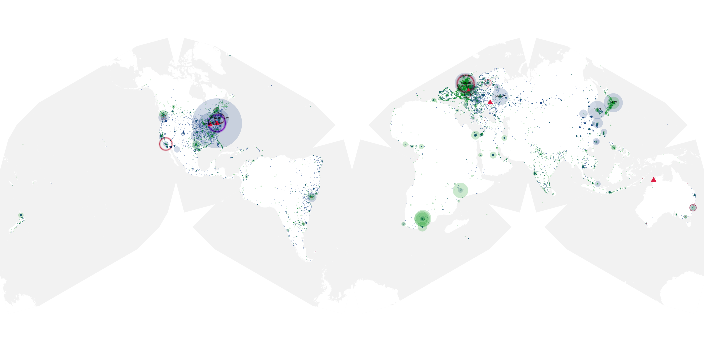
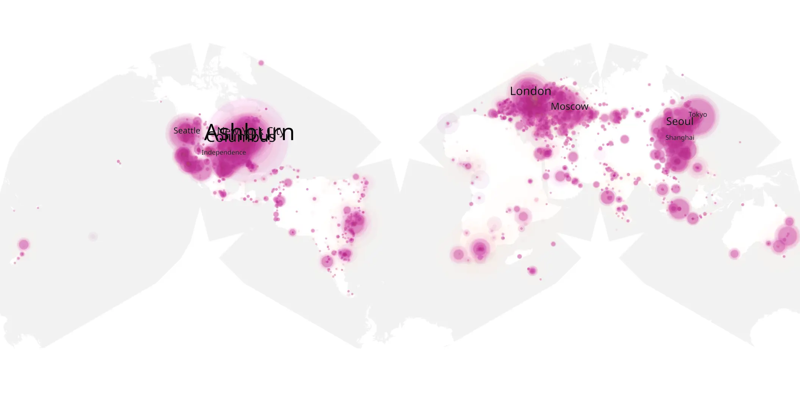
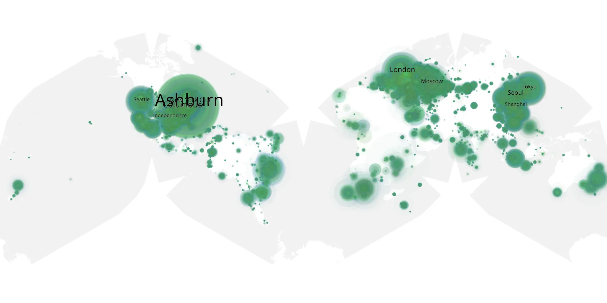

# high-fidelity-01 sample cache audit

## 1. Media object

| Field | Value |
| --- | --- |
| Media object | High Fidelity |
| Collection key | `high-fidelity-01` |
| imdb_id | [tt8577458](https://www.imdb.com/title/tt8577458/) |
| wikipedia_url | [High Fidelity (TV series)](https://en.wikipedia.org/wiki/High_Fidelity_(TV_series)) |
| Sample dates | 2020-02-14-to-2020-08-13 |
| Sample days | 182 |
| BTIH count | 206 |
| Unique BTIH count | 200 |
| Downloaders total | 9,477,456 |
| Uploaders total | 886,965 |
| Data version | `2026-08-05` |
| IP geolocation version | `6:1777968300` |

## 2. Sample coverage report

- Generated: 2026-09-04T03:20:38Z
- Evidence: read-only Day-member stream of the selected cache archive; no raw sample contents were opened
- Required sample span: 2020-02-14 to 2020-08-13 (182 days)
- Cache Day products: 182
- Sparse Day indices: 0
- Post-release Day products: 0

### Sample archive discontinuities

None detected.

## 3. Media objects file size histogram

## 4. Visualization pass — graphs

### Downloads by week cumulative (normalized start)



### Downloads by day, Saturday and Sunday in gray

## 5. Visualization pass — maps

### Cumulative geographic slices

| Africa | Americas | Asia | Europe | Oceania | Unknown |
| --- | --- | --- | --- | --- | --- |
| 3.53 | 39.75 | 17.62 | 25.88 | 1.59 | 9.40 |

### Cumulative network infrastructure

{:target="_blank" rel="noopener"}

### Cumulative data maps

**Cumulative >= 1080p**

{:target="_blank" rel="noopener"}

**Cumulative < 1080p**

{:target="_blank" rel="noopener"}
