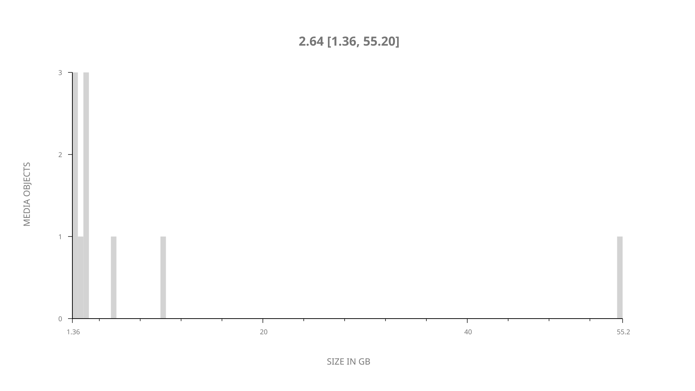
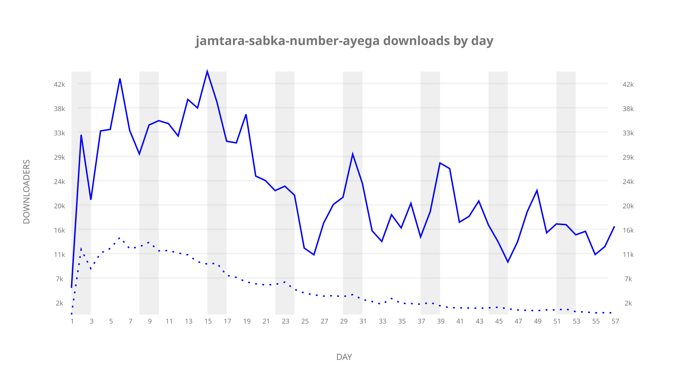
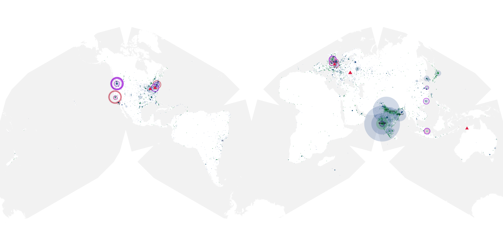
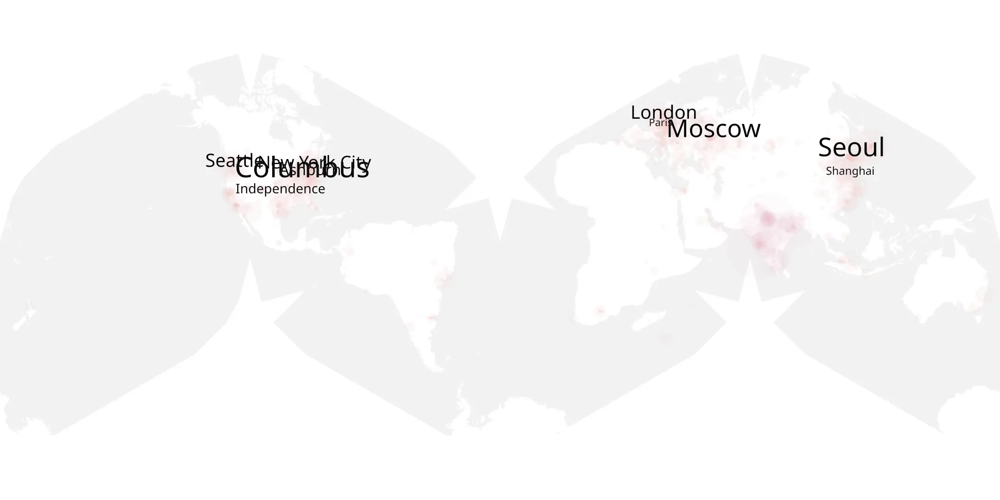
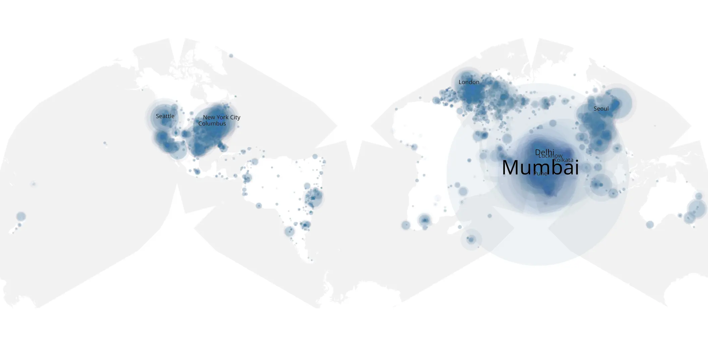

# jamtara-sabka-number-ayega sample cache audit

## 1. Media object

| Field | Value |
| --- | --- |
| Media object | Jamtara: Sabka Number Ayega |
| Collection key | `jamtara-sabka-number-ayega` |
| imdb_id | [tt11150912](https://www.imdb.com/title/tt11150912/) |
| wikipedia_url | [Jamtara – Sabka Number Ayega](https://en.wikipedia.org/wiki/Jamtara_%E2%80%93_Sabka_Number_Ayega) |
| Sample dates | 2020-01-10-to-2020-03-12 |
| Sample days | 63 |
| BTIH count | 12 |
| Unique BTIH count | 10 |
| Downloaders total | 1,056,854 |
| Uploaders total | 309,562 |
| Data version | `2026-08-05` |
| IP geolocation version | `6:1777968300` |

## 2. Coverage report

- Generated: 2026-09-04T03:20:38Z
- Evidence: read-only Day-member stream of the selected cache archive; no raw sample contents were opened
- Required sample span: 2020-01-10 to 2020-03-19 (70 days)
- Cache Day products: 64
- Sparse Day indices: 6
- Post-release Day products: 7

### Sample archive discontinuities

- missing Day index 33: `2020-02-11`
- missing Day index 34: `2020-02-12`
- missing Day index 35: `2020-02-13`
- missing Day index 36: `2020-02-14`
- missing Day index 37: `2020-02-15`
- missing Day index 38: `2020-02-16`

## 3. File sizes histogram *median[lowest, highest]*

## 4. Graphs

### Downloads by week cumulative (normalized start)



### Downloads by day, Saturday and Sunday in gray

## 5. Cumulative Maps

<!-- https://raw.githubusercontent.com/alpha60-devops/alpha60-results-2020/refs/heads/main/data/ -->

### <a href="https://raw.githubusercontent.com/alpha60-devops/alpha60-results-2020/refs/heads/main/data/geojson.cumulative/jamtara-sabka-number-ayega-cumulative-aggregate.geojson.gz" data-map-title="Jamtara: Sabka Number Ayega — jamtara-sabka-number-ayega" onclick="leaflet_map_open_window(this.href, this.dataset.mapTitle); return false;" class="table-link" aria-label="Open Jamtara: Sabka Number Ayega (jamtara-sabka-number-ayega) cumulative data map in new window" title="Opens interactive map for Jamtara: Sabka Number Ayega (jamtara-sabka-number-ayega) data">Swarm Detail</a>

### Geographic Regions

| Africa | Americas | Asia | Europe | Oceania | Unknown |
| --- | --- | --- | --- | --- | --- |
| 1.17 | 18.54 | 36.95 | 12.57 | 0.72 | 5.87 |

### Network infrastructure

{:target="_blank" rel="noopener"}

### Resolution >= 1080p

{:target="_blank" rel="noopener"}

### Resolution < 1080p

{:target="_blank" rel="noopener"}
