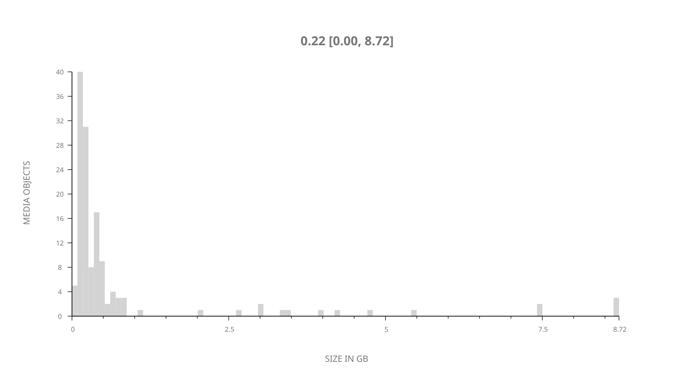
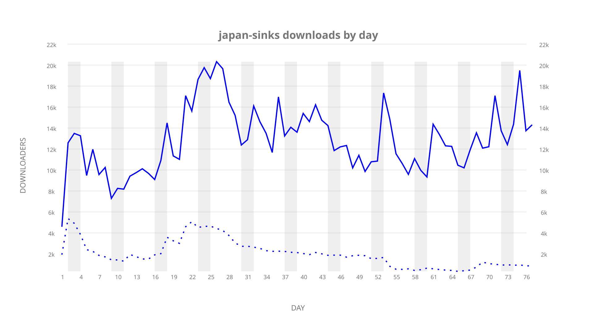
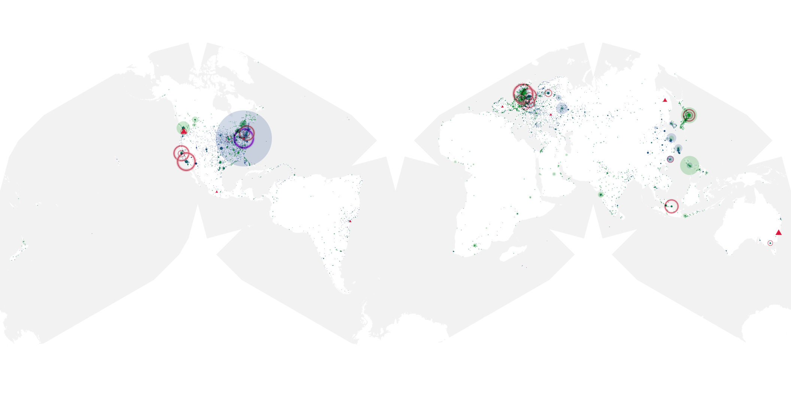
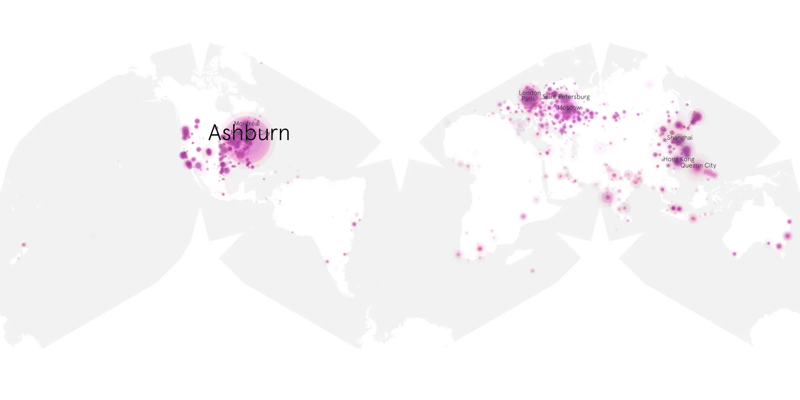
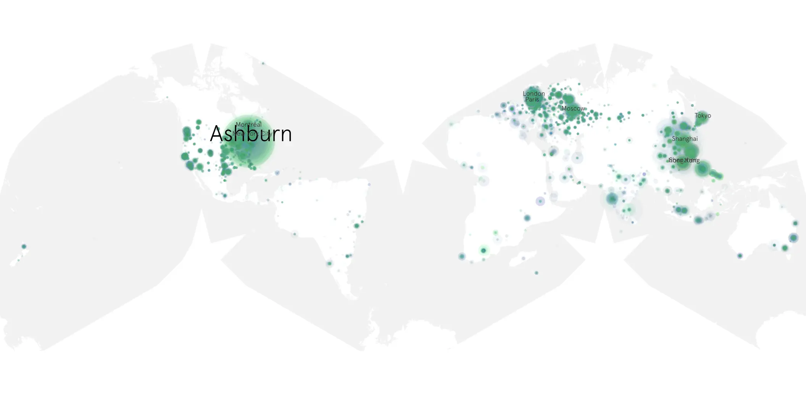

# japan-sinks sample cache audit

## 1. Media object

| Field | Value |
| --- | --- |
| Media object | Japan Sinks |
| Collection key | `japan-sinks` |
| imdb_id | [tt12031040](https://www.imdb.com/title/tt12031040/) |
| wikipedia_url | [Japan Sinks: 2020](https://en.wikipedia.org/wiki/Japan_Sinks:_2020) |
| Sample dates | 2020-07-09-to-2020-09-23 |
| Sample days | 77 |
| BTIH count | 169 |
| Unique BTIH count | 138 |
| Downloaders total | 916,282 |
| Uploaders total | 181,382 |
| Data version | `2026-08-05` |
| IP geolocation version | `6:1777968300` |

## 2. Sample coverage report

- Generated: 2026-09-04T03:20:38Z
- Evidence: read-only Day-member stream of the selected cache archive; no raw sample contents were opened
- Required sample span: 2020-07-09 to 2020-09-23 (77 days)
- Cache Day products: 77
- Sparse Day indices: 0
- Post-release Day products: 0

### Sample archive discontinuities

None detected.

## 3. Media objects file size histogram

## 4. Visualization pass — graphs

### Downloads by week cumulative (normalized start)



### Downloads by day, Saturday and Sunday in gray

## 5. Visualization pass — maps

### Cumulative geographic slices

| Africa | Americas | Asia | Europe | Oceania | Unknown |
| --- | --- | --- | --- | --- | --- |
| 1.44 | 48.79 | 18.98 | 23.39 | 1.01 | 3.34 |

### Cumulative network infrastructure

{:target="_blank" rel="noopener"}

### Cumulative data maps

**Cumulative >= 1080p**

{:target="_blank" rel="noopener"}

**Cumulative < 1080p**

{:target="_blank" rel="noopener"}
