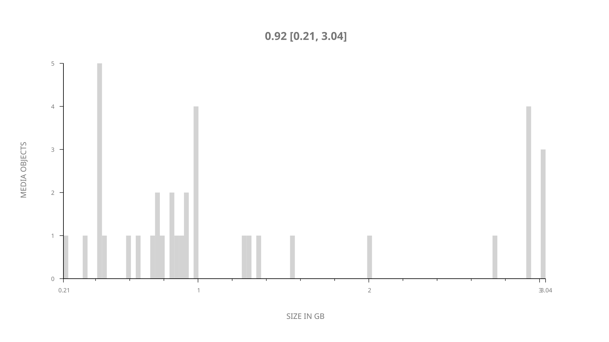
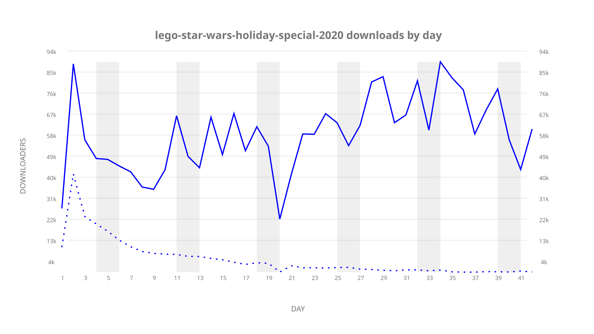
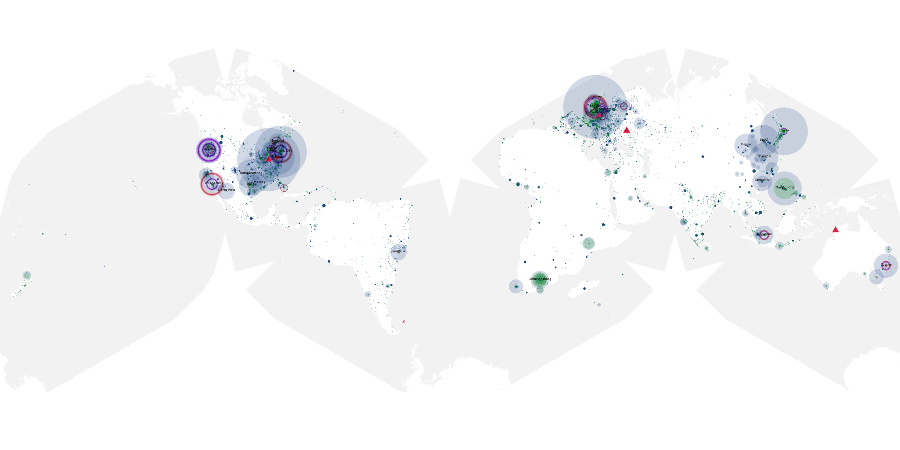
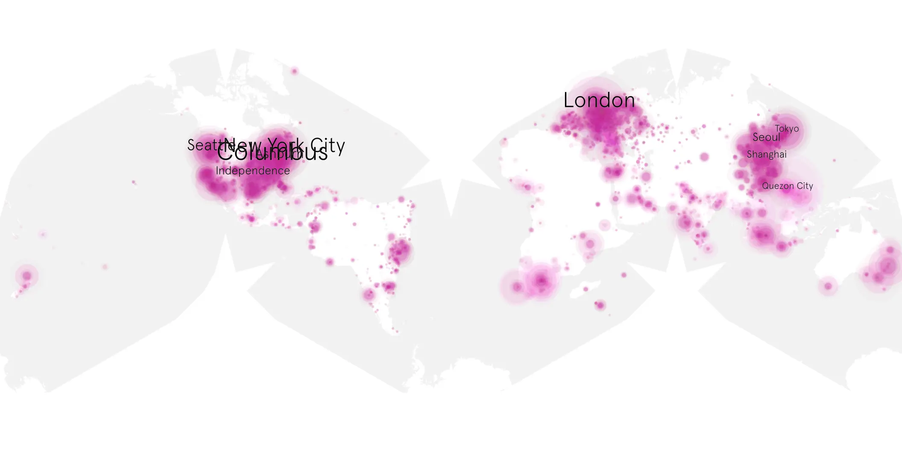
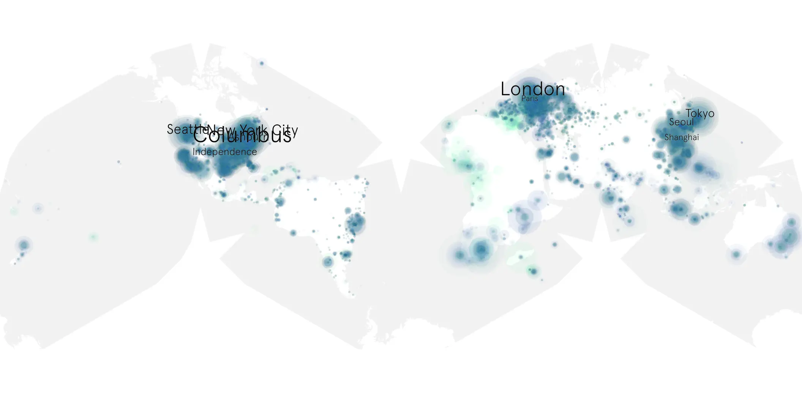

# lego-star-wars-holiday-special-2020 sample cache audit

## 1. Media object

| Field | Value |
| --- | --- |
| Media object | Lego Star Wars Holiday Special 2020 |
| Collection key | `lego-star-wars-holiday-special-2020` |
| imdb_id | [tt12885438](https://www.imdb.com/title/tt12885438/) |
| wikipedia_url | [The Lego Star Wars Holiday Special](https://en.wikipedia.org/wiki/The_Lego_Star_Wars_Holiday_Special) |
| Sample dates | 2020-11-17-to-2020-12-28 |
| Sample days | 42 |
| BTIH count | 54 |
| Unique BTIH count | 37 |
| Downloaders total | 1,926,875 |
| Uploaders total | 283,060 |
| Data version | `2026-08-05` |
| IP geolocation version | `6:1777968300` |

## 2. Coverage report

- Generated: 2026-09-10T15:44:02Z
- Sample archive directory: `/mnt/gold/src/alpha60-samples-raw.gold/lego-star-wars-holiday-special-2020.xz`
- Hour directories: 988
- Zero-length sample files: 0
- Other unparsable sample files: 0
- Hourly discontinuities: 3 (17 missing hours)
- Missing days: 0

### Sample archive discontinuities

- hourly gap: last `2020-12-06 07:00`, resumed `2020-12-06 23:00` — missing 15 hour(s)
- hourly gap: last `2020-12-08 21:00`, resumed `2020-12-08 23:00` — missing 1 hour(s)
- hourly gap: last `2020-12-14 00:00`, resumed `2020-12-14 02:00` — missing 1 hour(s)

## 3. File sizes histogram *median[lowest, highest]*

## 4. Graphs

### Downloads by week cumulative (normalized start)



### Downloads by day, Saturday and Sunday in gray

## 5. Cumulative Maps

<!-- https://raw.githubusercontent.com/alpha60-devops/alpha60-results-2020/refs/heads/main/data/ -->

### <a href="https://raw.githubusercontent.com/alpha60-devops/alpha60-results-2020/refs/heads/main/data/geojson.cumulative/lego-star-wars-holiday-special-2020-cumulative-aggregate.geojson.gz" data-map-title="Lego Star Wars Holiday Special 2020 — lego-star-wars-holiday-special-2020" onclick="leaflet_map_open_window(this.href, this.dataset.mapTitle); return false;" class="table-link" aria-label="Open Lego Star Wars Holiday Special 2020 (lego-star-wars-holiday-special-2020) cumulative data map in new window" title="Opens interactive map for Lego Star Wars Holiday Special 2020 (lego-star-wars-holiday-special-2020) data">Swarm Detail</a>

### Geographic Regions

| Africa | Americas | Asia | Europe | Oceania | Unknown |
| --- | --- | --- | --- | --- | --- |
| 5.72 | 35.20 | 19.55 | 19.10 | 2.23 | 9.45 |

### Network infrastructure

{:target="_blank" rel="noopener"}

### Resolution >= 1080p

{:target="_blank" rel="noopener"}

### Resolution < 1080p

{:target="_blank" rel="noopener"}
