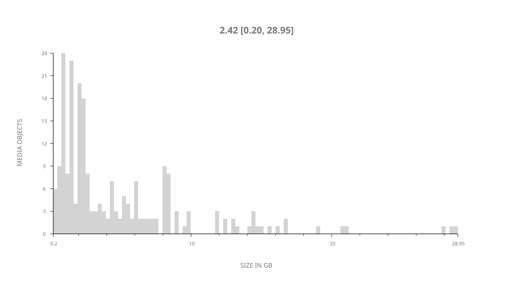
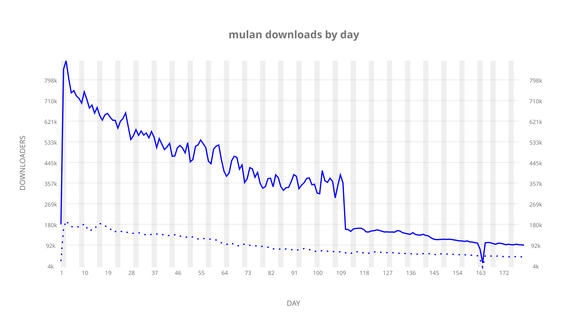
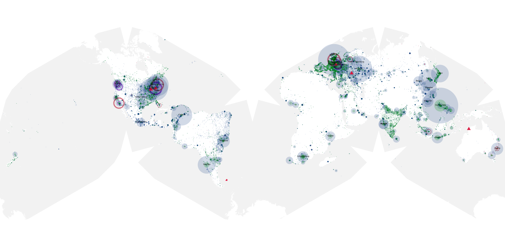
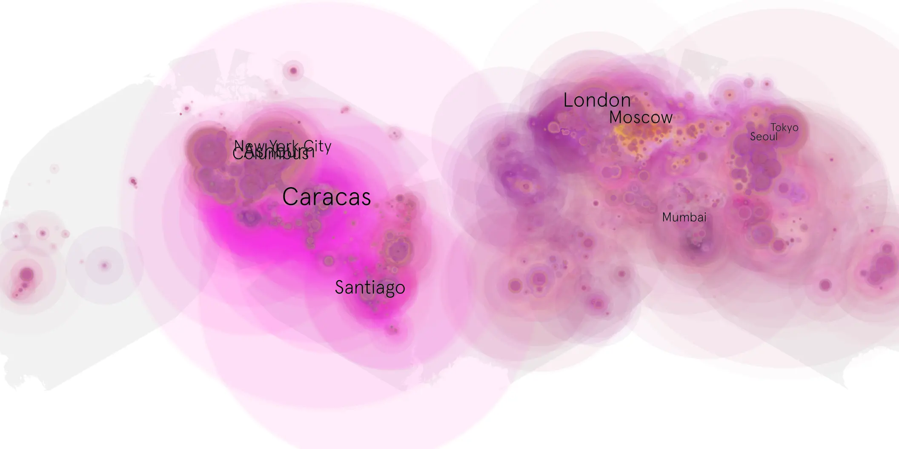
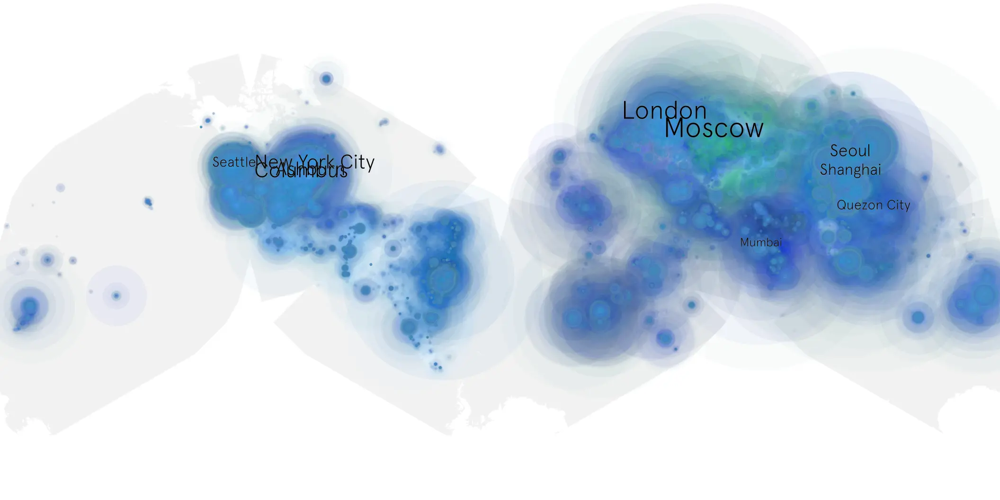

# mulan sample cache audit

## 1. Media object

| Field | Value |
| --- | --- |
| Media object | Mulan 2020 |
| Collection key | `mulan` |
| imdb_id | [tt4566758](https://www.imdb.com/title/tt4566758/) |
| wikipedia_url | [Mulan (2020 film)](https://en.wikipedia.org/wiki/Mulan_(2020_film)) |
| Sample dates | 2020-09-04-to-2021-03-04 |
| Sample days | 182 |
| BTIH count | 259 |
| Unique BTIH count | 223 |
| Downloaders total | 32,989,670 |
| Uploaders total | 8,286,285 |
| Data version | `2026-08-05` |
| IP geolocation version | `6:1777968300` |

## 2. Sample coverage report

- Generated: 2026-09-04T03:20:38Z
- Evidence: read-only Day-member stream of the selected cache archive; no raw sample contents were opened
- Required sample span: 2020-09-04 to 2021-03-04 (182 days)
- Cache Day products: 180
- Sparse Day indices: 2
- Post-release Day products: 0

### Sample archive discontinuities

- missing Day index 165: `2021-02-15`
- missing Day index 166: `2021-02-16`

## 3. Media objects file size histogram

## 4. Visualization pass — graphs

### Downloads by week cumulative (normalized start)



### Downloads by day, Saturday and Sunday in gray

## 5. Visualization pass — maps

### Cumulative geographic slices

| Africa | Americas | Asia | Europe | Oceania | Unknown |
| --- | --- | --- | --- | --- | --- |
| 5.35 | 33.41 | 23.32 | 24.96 | 1.68 | 4.87 |

### Cumulative network infrastructure

{:target="_blank" rel="noopener"}

### Cumulative data maps

**Cumulative >= 1080p**

{:target="_blank" rel="noopener"}

**Cumulative < 1080p**

{:target="_blank" rel="noopener"}
