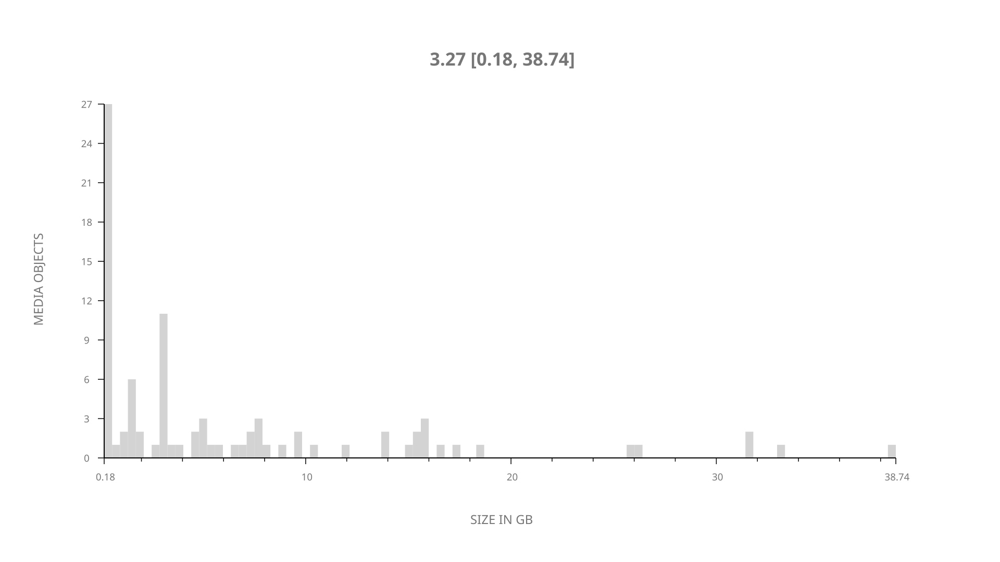
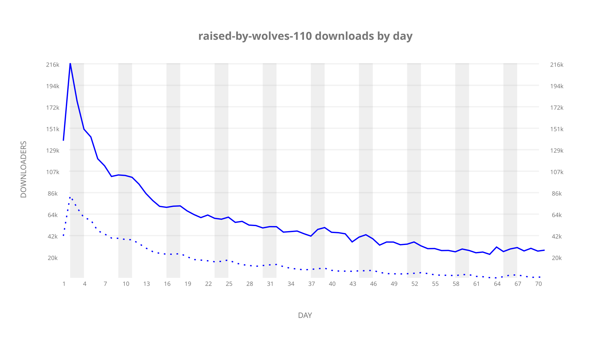
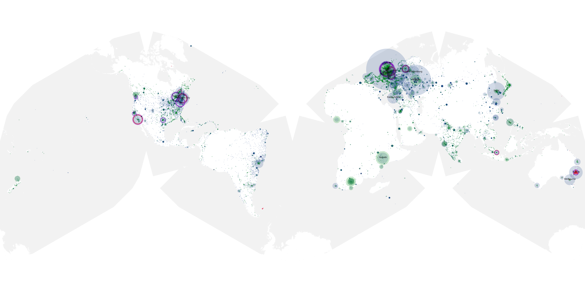
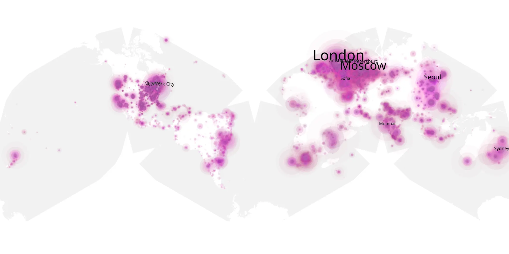
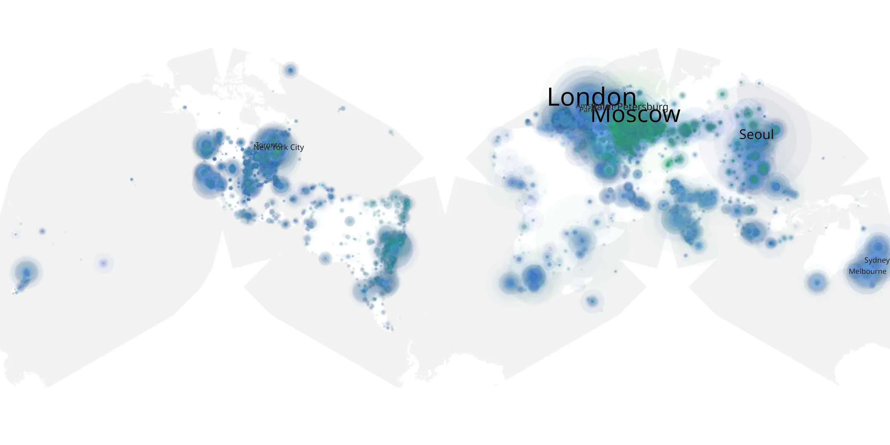

# raised-by-wolves-110 sample cache audit

## 1. Media object

| Field | Value |
| --- | --- |
| Media object | Raised by Wolves |
| Collection key | `raised-by-wolves-110` |
| imdb_id | [tt9170108](https://www.imdb.com/title/tt9170108/) |
| wikipedia_url | [Raised by Wolves (American TV series)](https://en.wikipedia.org/wiki/Raised_by_Wolves_(American_TV_series)) |
| Sample dates | 2020-10-01-to-2020-12-10 |
| Sample days | 71 |
| BTIH count | 110 |
| Unique BTIH count | 89 |
| Downloaders total | 3,392,577 |
| Uploaders total | 1,415,097 |
| Data version | `2026-08-05` |
| IP geolocation version | `6:1777968300` |

## 2. Sample coverage report

- Generated: 2026-09-04T03:20:38Z
- Evidence: read-only Day-member stream of the selected cache archive; no raw sample contents were opened
- Required sample span: 2020-10-01 to 2020-12-10 (71 days)
- Cache Day products: 71
- Sparse Day indices: 0
- Post-release Day products: 0

### Sample archive discontinuities

None detected.

## 3. Media objects file size histogram

## 4. Visualization pass — graphs

### Downloads by week cumulative (normalized start)



### Downloads by day, Saturday and Sunday in gray

## 5. Visualization pass — maps

### Cumulative geographic slices

| Africa | Americas | Asia | Europe | Oceania | Unknown |
| --- | --- | --- | --- | --- | --- |
| 5.25 | 25.24 | 18.31 | 39.61 | 3.20 | 0.94 |

### Cumulative network infrastructure

{:target="_blank" rel="noopener"}

### Cumulative data maps

**Cumulative >= 1080p**

{:target="_blank" rel="noopener"}

**Cumulative < 1080p**

{:target="_blank" rel="noopener"}
