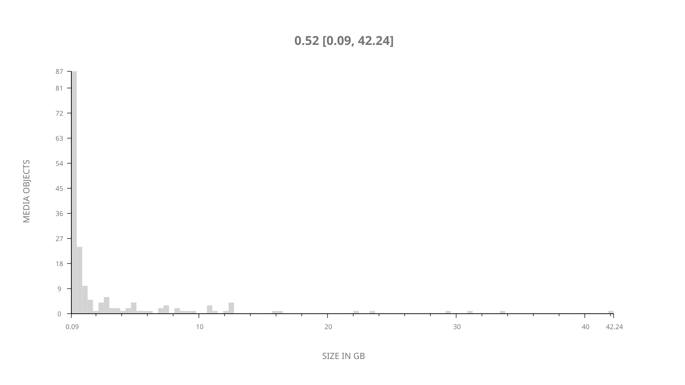
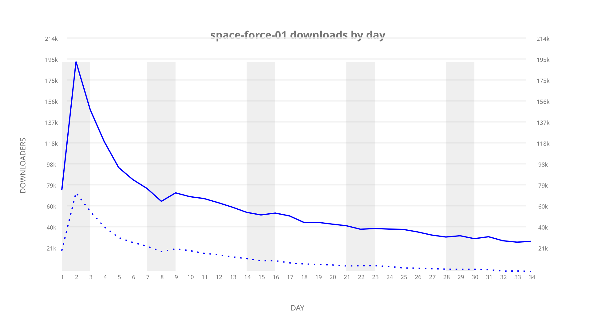
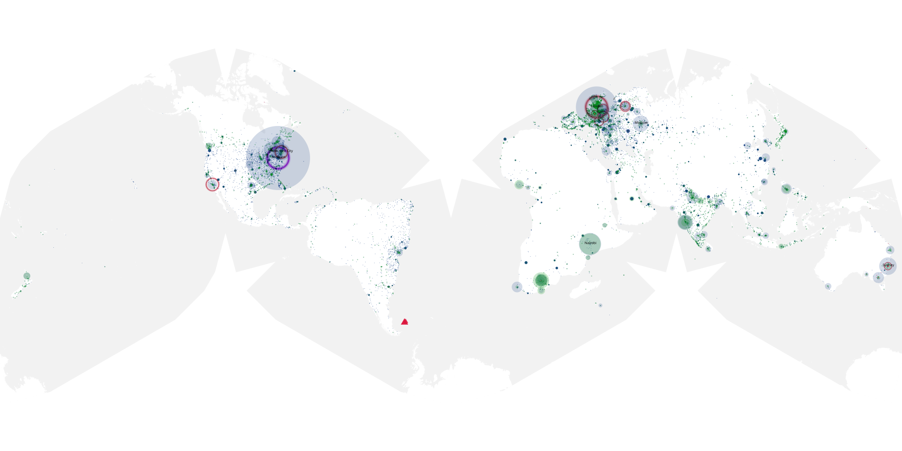
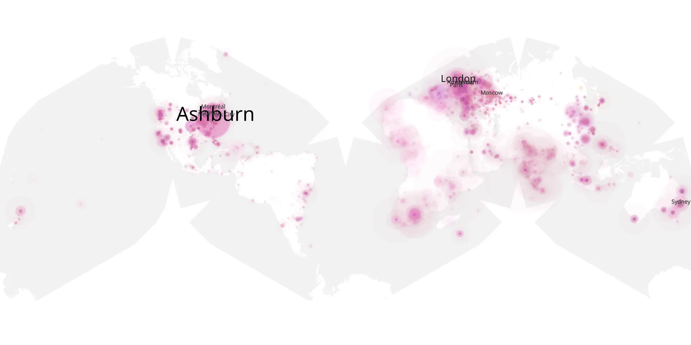
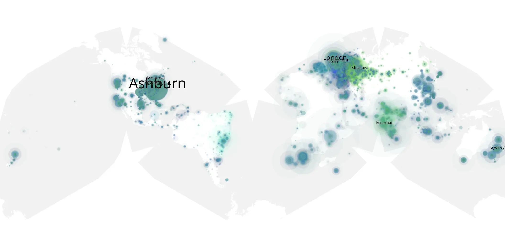

# space-force-01 sample cache audit

## 1. Media object

| Field | Value |
| --- | --- |
| Media object | Space Force |
| Collection key | `space-force-01` |
| imdb_id | [tt9612516](https://www.imdb.com/title/tt9612516/) |
| wikipedia_url | [Space Force (TV series)](https://en.wikipedia.org/wiki/Space_Force_(TV_series)) |
| Sample dates | 2020-05-29-to-2020-07-02 |
| Sample days | 35 |
| BTIH count | 181 |
| Unique BTIH count | 178 |
| Downloaders total | 1,587,181 |
| Uploaders total | 635,936 |
| Data version | `2026-08-05` |
| IP geolocation version | `6:1777968300` |

## 2. Coverage report

- Generated: 2026-09-04T03:20:38Z
- Evidence: read-only Day-member stream of the selected cache archive; no raw sample contents were opened
- Required sample span: 2020-05-29 to 2020-07-02 (35 days)
- Cache Day products: 34
- Sparse Day indices: 1
- Post-release Day products: 0

### Sample archive discontinuities

- missing Day index 8: `2020-06-05`

## 3. File sizes histogram *median[lowest, highest]*

## 4. Graphs

### Downloads by week cumulative (normalized start)



### Downloads by day, Saturday and Sunday in gray

## 5. Cumulative Maps

<!-- https://raw.githubusercontent.com/alpha60-devops/alpha60-results-2020/refs/heads/main/data/ -->

### <a href="https://raw.githubusercontent.com/alpha60-devops/alpha60-results-2020/refs/heads/main/data/geojson.cumulative/space-force-01-cumulative-aggregate.geojson.gz" data-map-title="Space Force — space-force-01" onclick="leaflet_map_open_window(this.href, this.dataset.mapTitle); return false;" class="table-link" aria-label="Open Space Force (space-force-01) cumulative data map in new window" title="Opens interactive map for Space Force (space-force-01) data">Swarm Detail</a>

### Geographic Regions

| Africa | Americas | Asia | Europe | Oceania | Unknown |
| --- | --- | --- | --- | --- | --- |
| 7.65 | 26.33 | 17.24 | 28.04 | 3.38 | 0.71 |

### Network infrastructure

{:target="_blank" rel="noopener"}

### Resolution >= 1080p

{:target="_blank" rel="noopener"}

### Resolution < 1080p

{:target="_blank" rel="noopener"}
