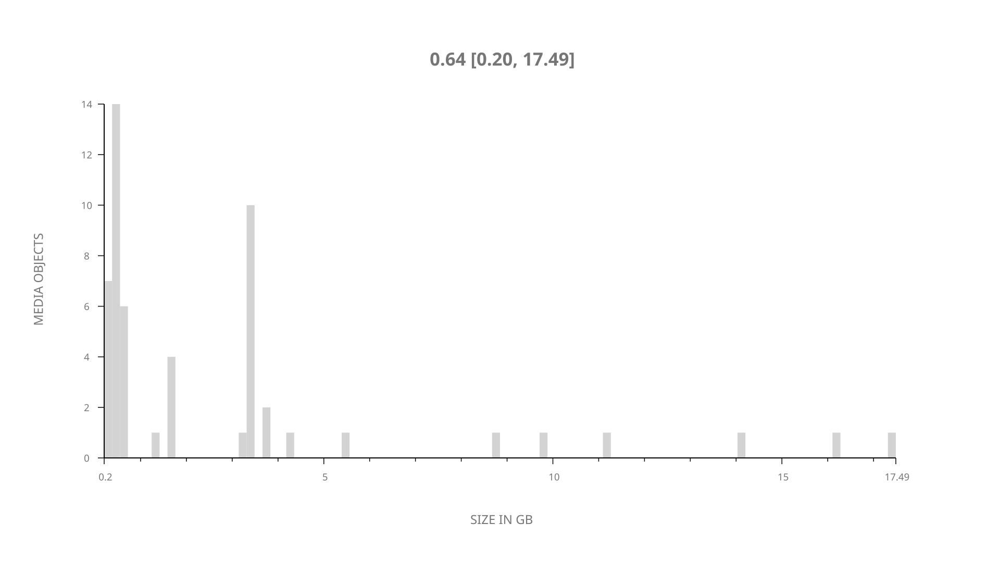
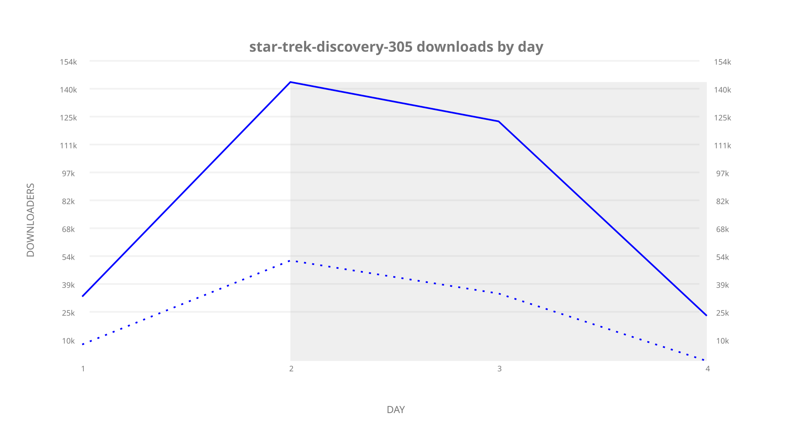
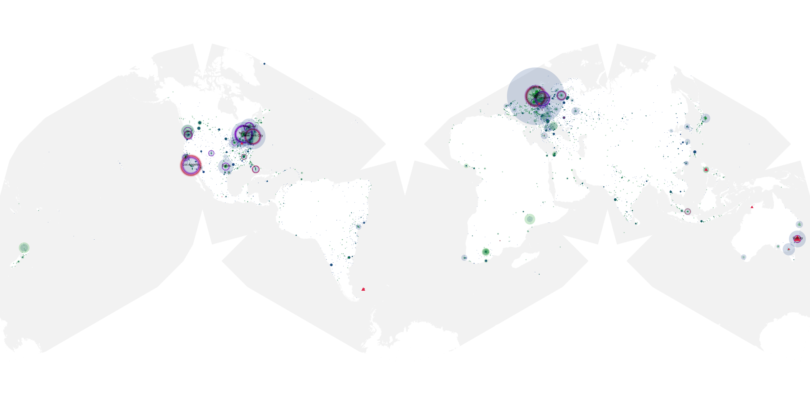
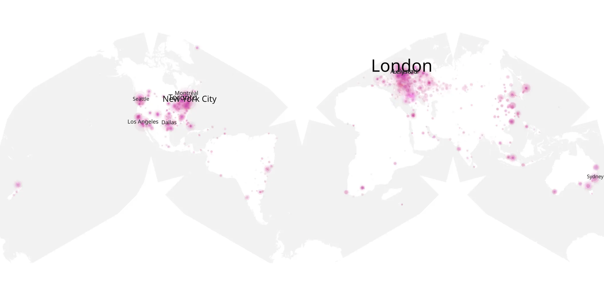
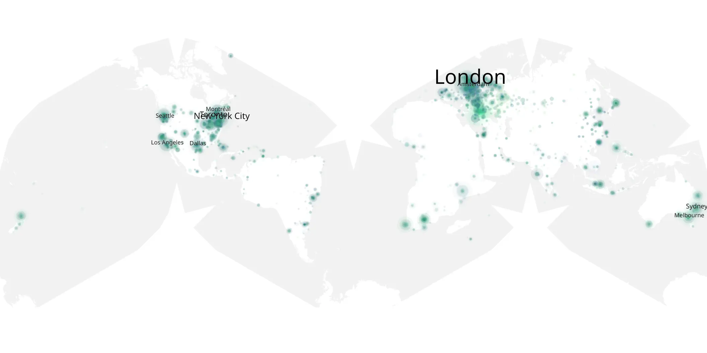

# star-trek-discovery-305 sample cache audit

## 1. Media object

| Field | Value |
| --- | --- |
| Media object | Star Trek Discovery |
| Collection key | `star-trek-discovery-305` |
| imdb_id | [tt5171438](https://www.imdb.com/title/tt5171438/) |
| wikipedia_url | [Star Trek: Discovery](https://en.wikipedia.org/wiki/Star_Trek:_Discovery) |
| Sample dates | 2020-11-12-to-2020-11-15 |
| Sample days | 4 |
| BTIH count | 55 |
| Unique BTIH count | 53 |
| Downloaders total | 291,756 |
| Uploaders total | 104,665 |
| Data version | `2026-08-05` |
| IP geolocation version | `6:1777968300` |

## 2. Sample coverage report

- Generated: 2026-09-10T15:44:03Z
- Sample archive directory: `/mnt/gold/src/alpha60-samples-raw.gold/star-trek-discovery-305.xz`
- Hour directories: 54
- Zero-length sample files: 0
- Other unparsable sample files: 0
- Hourly discontinuities: 0 (0 missing hours)
- Missing days: 0

### Sample archive discontinuities

None detected.

## 3. Media objects file size histogram

## 4. Visualization pass — graphs

### Downloads by week cumulative (normalized start)



### Downloads by day, Saturday and Sunday in gray

## 5. Visualization pass — maps

### Cumulative geographic slices

| Africa | Americas | Asia | Europe | Oceania | Unknown |
| --- | --- | --- | --- | --- | --- |
| 2.76 | 33.43 | 10.49 | 33.80 | 4.09 | 3.17 |

### Cumulative network infrastructure

{:target="_blank" rel="noopener"}

### Cumulative data maps

**Cumulative >= 1080p**

{:target="_blank" rel="noopener"}

**Cumulative < 1080p**

{:target="_blank" rel="noopener"}
