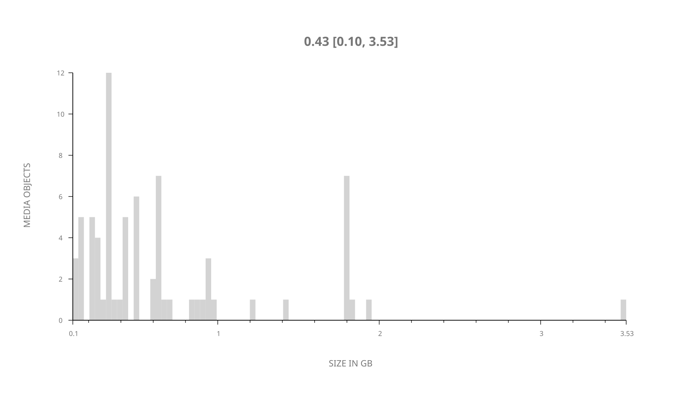
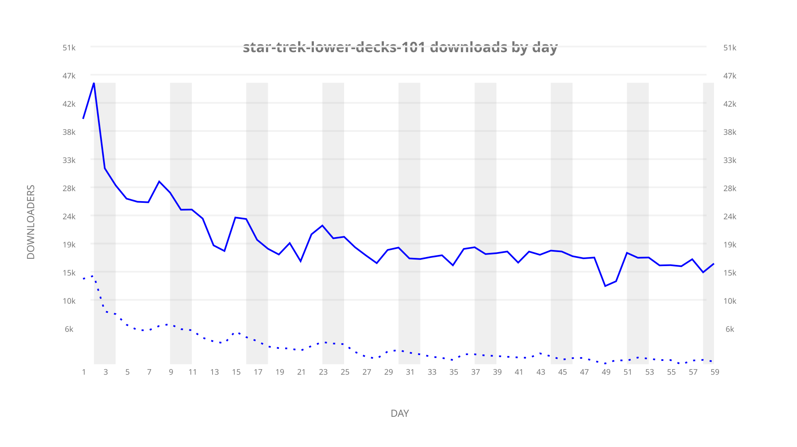
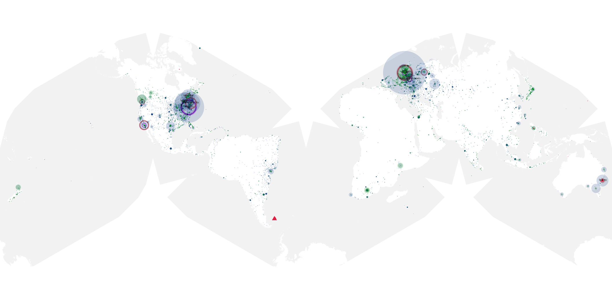
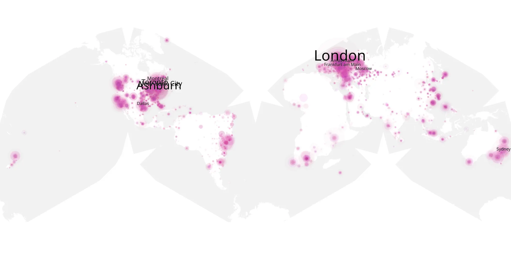
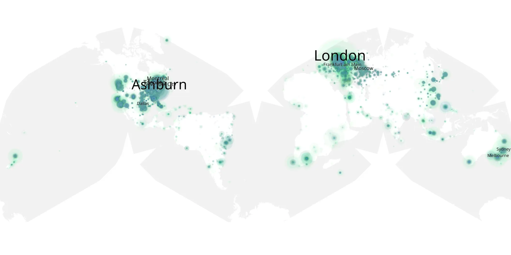

# star-trek-lower-decks-101 sample cache audit

## 1. Media object

| Field | Value |
| --- | --- |
| Media object | Star Trek: Lower Decks |
| Collection key | `star-trek-lower-decks-101` |
| imdb_id | [tt9184820](https://www.imdb.com/title/tt9184820/) |
| wikipedia_url | [Star Trek: Lower Decks](https://en.wikipedia.org/wiki/Star_Trek:_Lower_Decks) |
| Sample dates | 2020-08-06-to-2020-10-03 |
| Sample days | 59 |
| BTIH count | 81 |
| Unique BTIH count | 73 |
| Downloaders total | 931,613 |
| Uploaders total | 270,577 |
| Data version | `2026-08-05` |
| IP geolocation version | `6:1777968300` |

## 2. Sample coverage report

- Generated: 2026-09-04T03:20:38Z
- Evidence: read-only Day-member stream of the selected cache archive; no raw sample contents were opened
- Required sample span: 2020-08-06 to 2020-10-03 (59 days)
- Cache Day products: 59
- Sparse Day indices: 0
- Post-release Day products: 0

### Sample archive discontinuities

None detected.

## 3. Media objects file size histogram

## 4. Visualization pass — graphs

### Downloads by week cumulative (normalized start)



### Downloads by day, Saturday and Sunday in gray

## 5. Visualization pass — maps

### Cumulative geographic slices

| Africa | Americas | Asia | Europe | Oceania | Unknown |
| --- | --- | --- | --- | --- | --- |
| 2.76 | 45.72 | 8.12 | 29.13 | 4.02 | 0.86 |

### Cumulative network infrastructure

{:target="_blank" rel="noopener"}

### Cumulative data maps

**Cumulative >= 1080p**

{:target="_blank" rel="noopener"}

**Cumulative < 1080p**

{:target="_blank" rel="noopener"}
