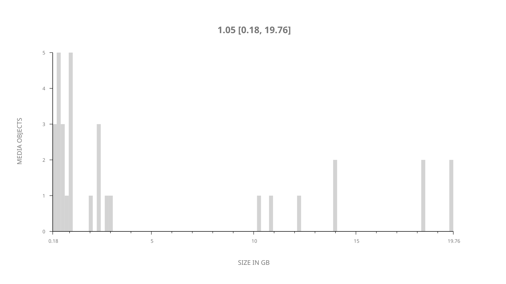
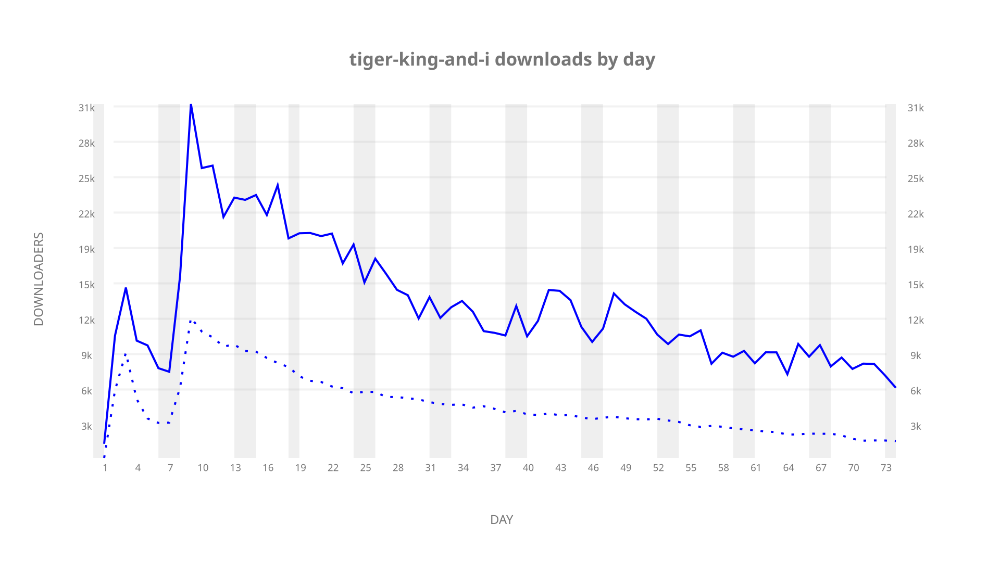
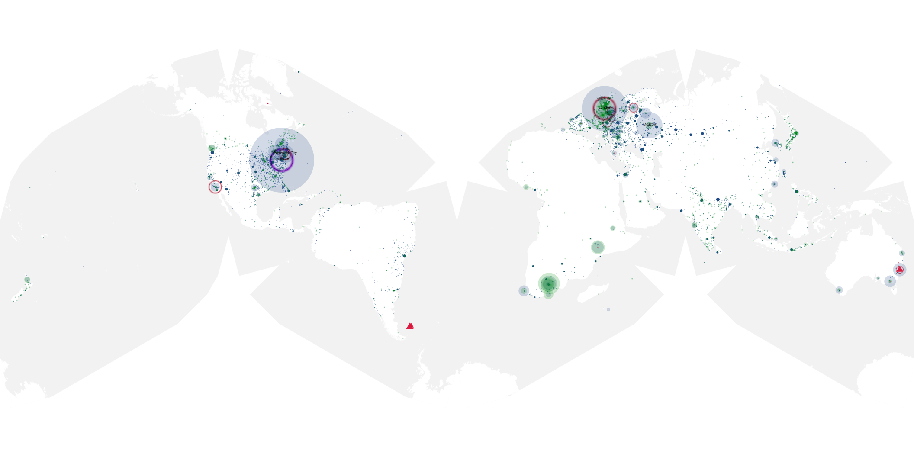
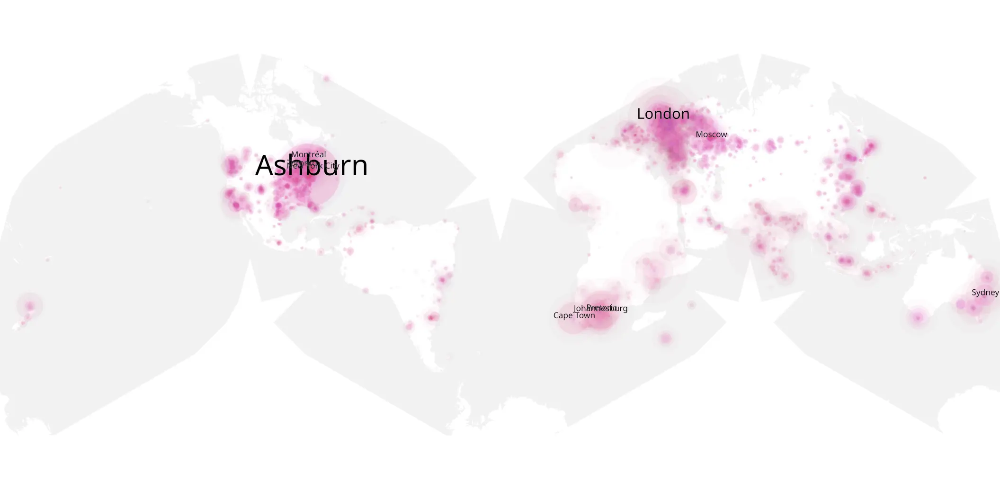
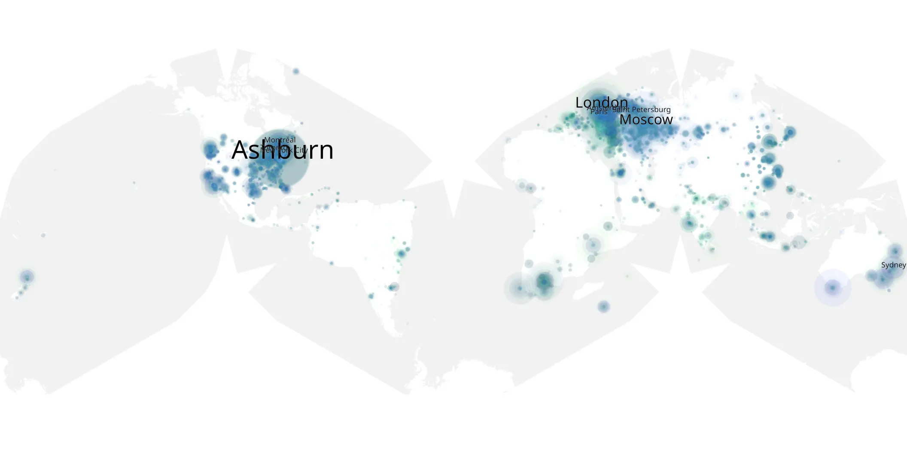

# tiger-king-and-i sample cache audit

## 1. Media object

| Field | Value |
| --- | --- |
| Media object | The Tiger King and I & Extras |
| Collection key | `tiger-king-and-i` |
| imdb_id | [tt11823076](https://www.imdb.com/title/tt11823076/) |
| wikipedia_url | [Tiger King](https://en.wikipedia.org/wiki/Tiger_King) |
| Sample dates | 2020-04-12-to-2020-06-27 |
| Sample days | 77 |
| BTIH count | 42 |
| Unique BTIH count | 32 |
| Downloaders total | 766,157 |
| Uploaders total | 301,875 |
| Data version | `2026-08-05` |
| IP geolocation version | `6:1777968300` |

## 2. Coverage report

- Generated: 2026-09-04T03:20:38Z
- Evidence: read-only Day-member stream of the selected cache archive; no raw sample contents were opened
- Required sample span: 2020-04-12 to 2020-06-27 (77 days)
- Cache Day products: 74
- Sparse Day indices: 3
- Post-release Day products: 0

### Sample archive discontinuities

- missing Day index 19: `2020-04-30`
- missing Day index 20: `2020-05-01`
- missing Day index 21: `2020-05-02`

## 3. File sizes histogram *median[lowest, highest]*

## 4. Graphs

### Downloads by week cumulative (normalized start)



### Downloads by day, Saturday and Sunday in gray

## 5. Cumulative Maps

<!-- https://raw.githubusercontent.com/alpha60-devops/alpha60-results-2020/refs/heads/main/data/ -->

### <a href="https://raw.githubusercontent.com/alpha60-devops/alpha60-results-2020/refs/heads/main/data/geojson.cumulative/tiger-king-and-i-cumulative-aggregate.geojson.gz" data-map-title="The Tiger King and I &amp; Extras — tiger-king-and-i" onclick="leaflet_map_open_window(this.href, this.dataset.mapTitle); return false;" class="table-link" aria-label="Open The Tiger King and I &amp; Extras (tiger-king-and-i) cumulative data map in new window" title="Opens interactive map for The Tiger King and I &amp; Extras (tiger-king-and-i) data">Swarm Detail</a>

### Geographic Regions

| Africa | Americas | Asia | Europe | Oceania | Unknown |
| --- | --- | --- | --- | --- | --- |
| 5.12 | 30.60 | 9.58 | 32.28 | 3.32 | 1.11 |

### Network infrastructure

{:target="_blank" rel="noopener"}

### Resolution >= 1080p

{:target="_blank" rel="noopener"}

### Resolution < 1080p

{:target="_blank" rel="noopener"}
