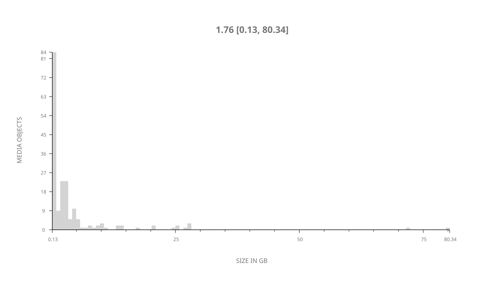
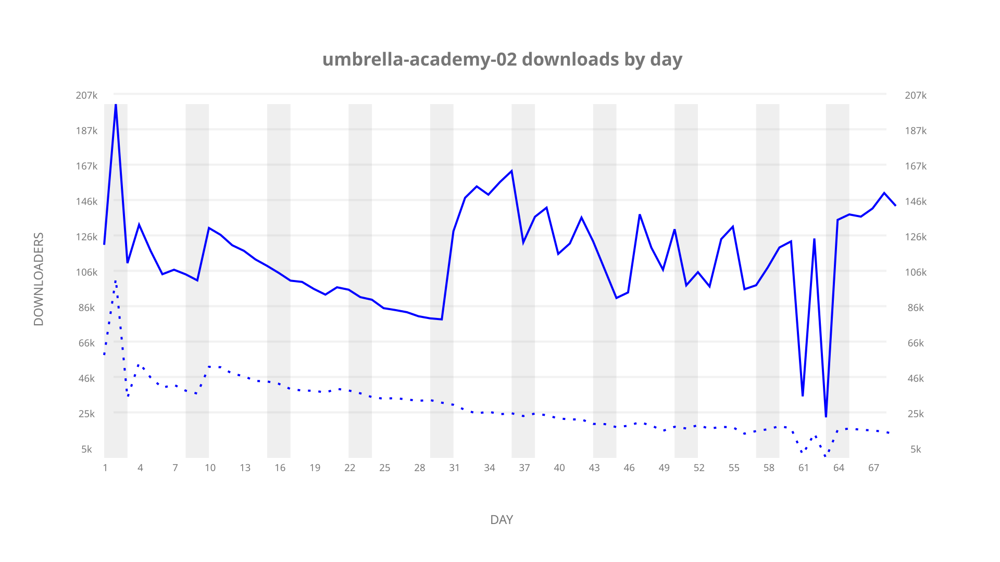
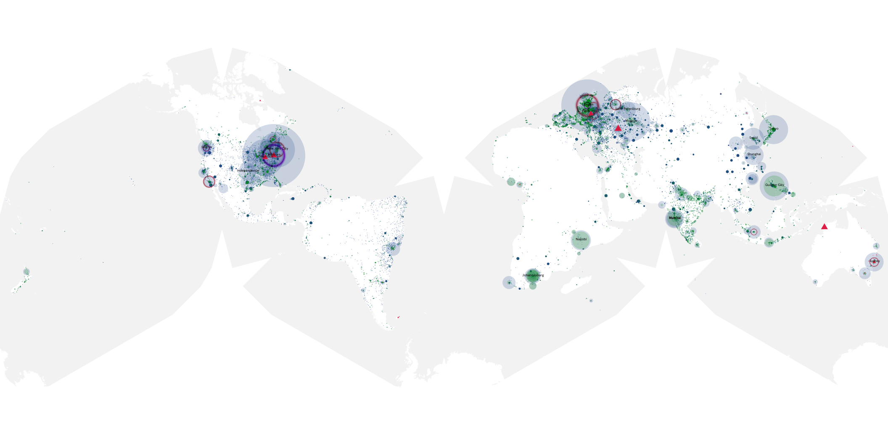
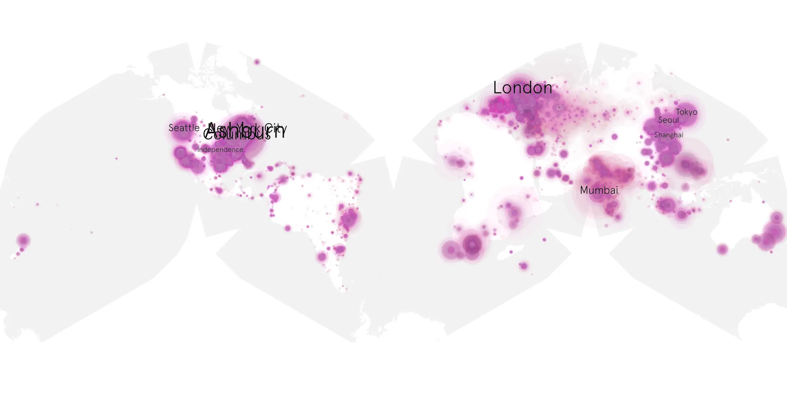
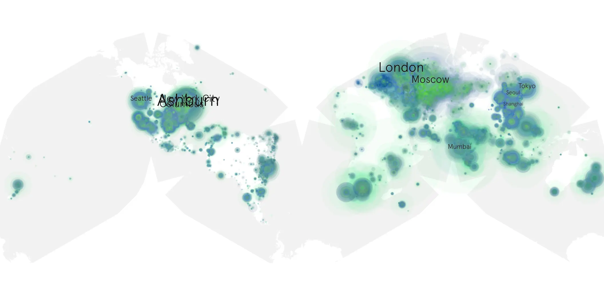

# umbrella-academy-02 sample cache audit

## 1. Media object

| Field | Value |
| --- | --- |
| Media object | The Umbrella Academy |
| Collection key | `umbrella-academy-02` |
| imdb_id | [tt1312171](https://www.imdb.com/title/tt1312171/) |
| wikipedia_url | [The Umbrella Academy (TV series)](https://en.wikipedia.org/wiki/The_Umbrella_Academy_(TV_series)) |
| Sample dates | 2020-07-31-to-2020-10-08 |
| Sample days | 70 |
| BTIH count | 190 |
| Unique BTIH count | 186 |
| Downloaders total | 4,675,170 |
| Uploaders total | 1,091,493 |
| Data version | `2026-08-05` |
| IP geolocation version | `6:1777968300` |

## 2. Coverage report

- Generated: 2026-09-04T03:20:38Z
- Evidence: read-only Day-member stream of the selected cache archive; no raw sample contents were opened
- Required sample span: 2020-07-31 to 2020-10-08 (70 days)
- Cache Day products: 69
- Sparse Day indices: 1
- Post-release Day products: 0

### Sample archive discontinuities

- missing Day index 64: `2020-10-02`

## 3. File sizes histogram *median[lowest, highest]*

## 4. Graphs

### Downloads by week cumulative (normalized start)



### Downloads by day, Saturday and Sunday in gray

## 5. Cumulative Maps

<!-- https://raw.githubusercontent.com/alpha60-devops/alpha60-results-2020/refs/heads/main/data/ -->

### <a href="https://raw.githubusercontent.com/alpha60-devops/alpha60-results-2020/refs/heads/main/data/geojson.cumulative/umbrella-academy-02-cumulative-aggregate.geojson.gz" data-map-title="The Umbrella Academy — umbrella-academy-02" onclick="leaflet_map_open_window(this.href, this.dataset.mapTitle); return false;" class="table-link" aria-label="Open The Umbrella Academy (umbrella-academy-02) cumulative data map in new window" title="Opens interactive map for The Umbrella Academy (umbrella-academy-02) data">Swarm Detail</a>

### Geographic Regions

| Africa | Americas | Asia | Europe | Oceania | Unknown |
| --- | --- | --- | --- | --- | --- |
| 4.60 | 29.87 | 20.30 | 28.52 | 2.02 | 6.20 |

### Network infrastructure

{:target="_blank" rel="noopener"}

### Resolution >= 1080p

{:target="_blank" rel="noopener"}

### Resolution < 1080p

{:target="_blank" rel="noopener"}
