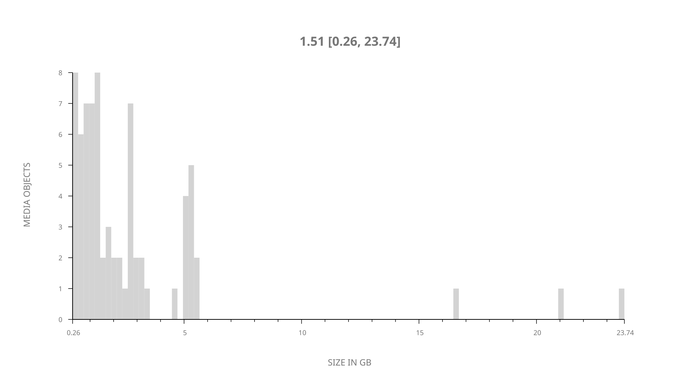
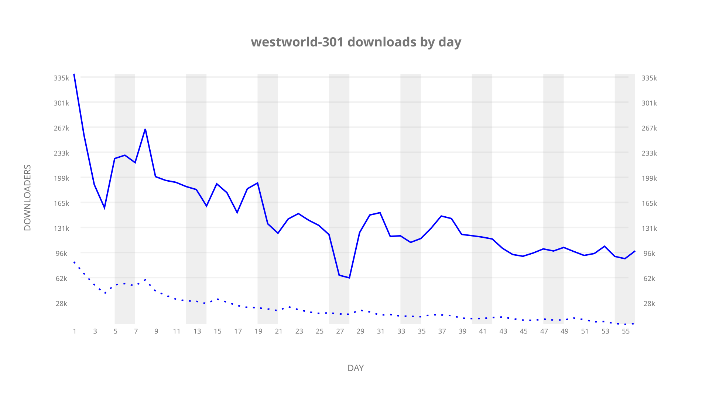
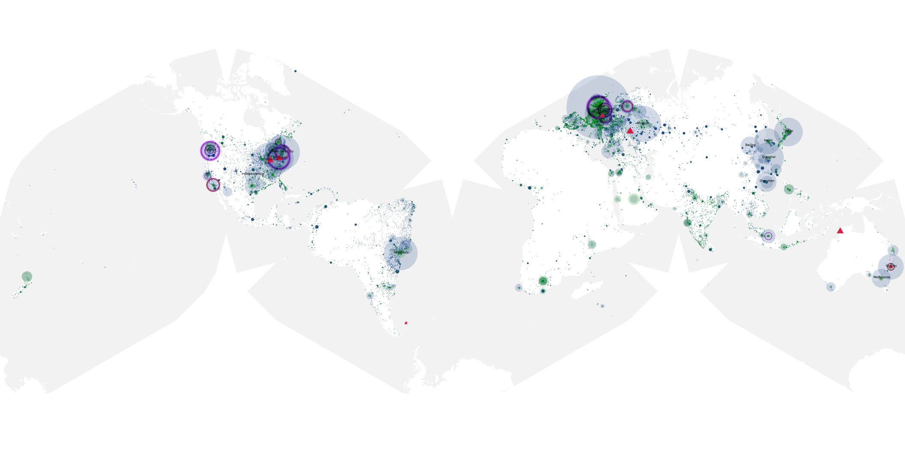
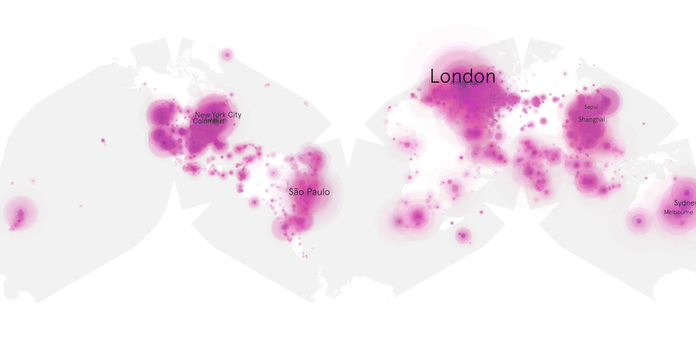
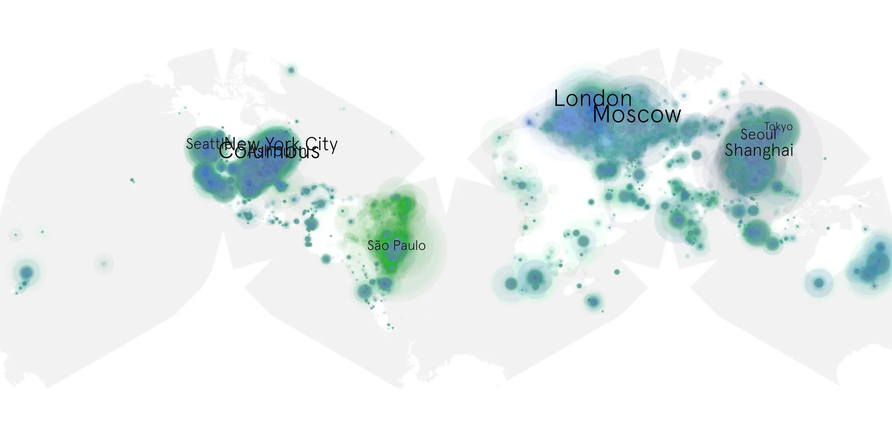

# westworld-301 sample cache audit

## 1. Media object

| Field | Value |
| --- | --- |
| Media object | Westworld |
| Collection key | `westworld-301` |
| imdb_id | [tt0475784](https://www.imdb.com/title/tt0475784/) |
| wikipedia_url | [Westworld (TV series)](https://en.wikipedia.org/wiki/Westworld_(TV_series)) |
| Sample dates | 2020-03-16-to-2020-05-10 |
| Sample days | 56 |
| BTIH count | 89 |
| Unique BTIH count | 73 |
| Downloaders total | 6,250,048 |
| Uploaders total | 1,627,151 |
| Data version | `2026-08-05` |
| IP geolocation version | `6:1777968300` |

## 2. Coverage report

- Generated: 2026-09-04T03:20:38Z
- Evidence: read-only Day-member stream of the selected cache archive; no raw sample contents were opened
- Required sample span: 2020-03-16 to 2020-05-10 (56 days)
- Cache Day products: 56
- Sparse Day indices: 0
- Post-release Day products: 0

### Sample archive discontinuities

None detected.

## 3. File sizes histogram *median[lowest, highest]*

## 4. Graphs

### Downloads by week cumulative (normalized start)



### Downloads by day, Saturday and Sunday in gray

## 5. Cumulative Maps

<!-- https://raw.githubusercontent.com/alpha60-devops/alpha60-results-2020/refs/heads/main/data/ -->

### <a href="https://raw.githubusercontent.com/alpha60-devops/alpha60-results-2020/refs/heads/main/data/geojson.cumulative/westworld-301-cumulative-aggregate.geojson.gz" data-map-title="Westworld — westworld-301" onclick="leaflet_map_open_window(this.href, this.dataset.mapTitle); return false;" class="table-link" aria-label="Open Westworld (westworld-301) cumulative data map in new window" title="Opens interactive map for Westworld (westworld-301) data">Swarm Detail</a>

### Geographic Regions

| Africa | Americas | Asia | Europe | Oceania | Unknown |
| --- | --- | --- | --- | --- | --- |
| 3.29 | 31.36 | 18.82 | 28.98 | 2.87 | 5.99 |

### Network infrastructure

{:target="_blank" rel="noopener"}

### Resolution >= 1080p

{:target="_blank" rel="noopener"}

### Resolution < 1080p

{:target="_blank" rel="noopener"}
