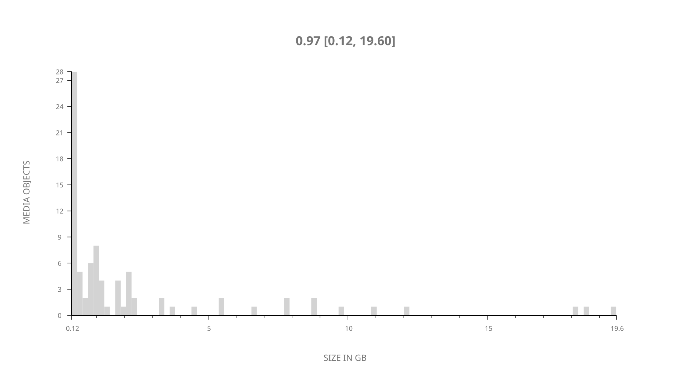
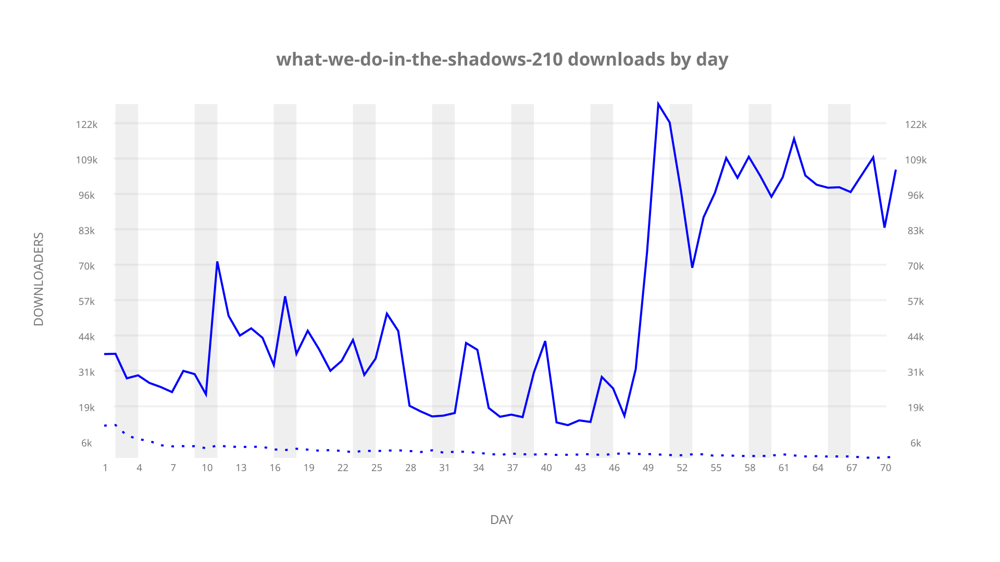
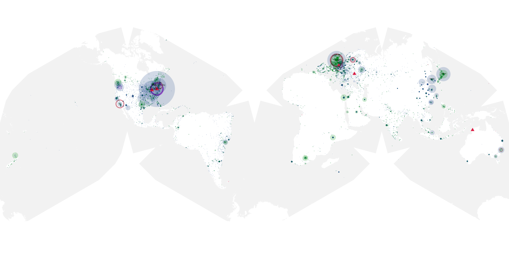
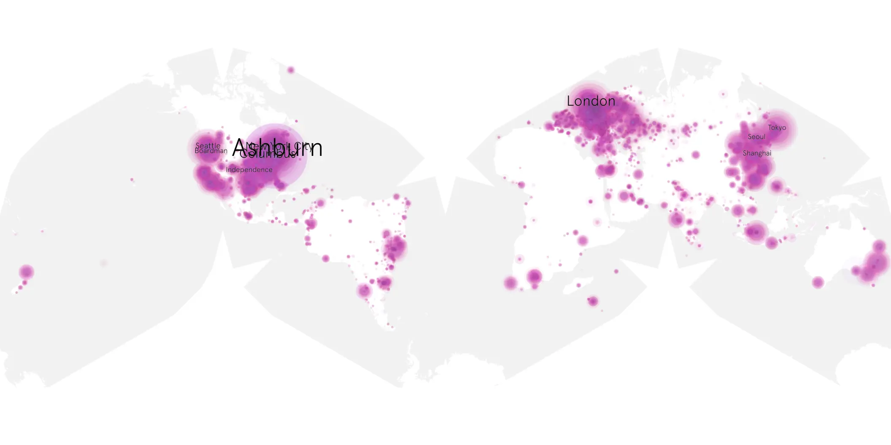
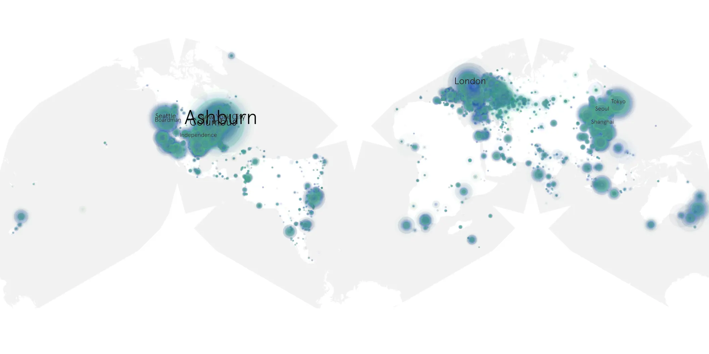

# what-we-do-in-the-shadows-210 sample cache audit

## 1. Media object

| Field | Value |
| --- | --- |
| Media object | What We Do In The Shadows |
| Collection key | `what-we-do-in-the-shadows-210` |
| imdb_id | [tt7908628](https://www.imdb.com/title/tt7908628/) |
| wikipedia_url | [What We Do in the Shadows (TV series)](https://en.wikipedia.org/wiki/What_We_Do_in_the_Shadows_(TV_series)) |
| Sample dates | 2020-06-11-to-2020-08-20 |
| Sample days | 71 |
| BTIH count | 118 |
| Unique BTIH count | 83 |
| Downloaders total | 3,025,311 |
| Uploaders total | 353,759 |
| Data version | `2026-08-05` |
| IP geolocation version | `6:1777968300` |

## 2. Coverage report

- Generated: 2026-09-04T03:20:38Z
- Evidence: read-only Day-member stream of the selected cache archive; no raw sample contents were opened
- Required sample span: 2020-06-11 to 2020-08-20 (71 days)
- Cache Day products: 71
- Sparse Day indices: 0
- Post-release Day products: 0

### Sample archive discontinuities

None detected.

## 3. File sizes histogram *median[lowest, highest]*

## 4. Graphs

### Downloads by week cumulative (normalized start)



### Downloads by day, Saturday and Sunday in gray

## 5. Cumulative Maps

<!-- https://raw.githubusercontent.com/alpha60-devops/alpha60-results-2020/refs/heads/main/data/ -->

### <a href="https://raw.githubusercontent.com/alpha60-devops/alpha60-results-2020/refs/heads/main/data/geojson.cumulative/what-we-do-in-the-shadows-210-cumulative-aggregate.geojson.gz" data-map-title="What We Do In The Shadows — what-we-do-in-the-shadows-210" onclick="leaflet_map_open_window(this.href, this.dataset.mapTitle); return false;" class="table-link" aria-label="Open What We Do In The Shadows (what-we-do-in-the-shadows-210) cumulative data map in new window" title="Opens interactive map for What We Do In The Shadows (what-we-do-in-the-shadows-210) data">Swarm Detail</a>

### Geographic Regions

| Africa | Americas | Asia | Europe | Oceania | Unknown |
| --- | --- | --- | --- | --- | --- |
| 2.18 | 42.47 | 16.42 | 23.65 | 2.05 | 9.64 |

### Network infrastructure

{:target="_blank" rel="noopener"}

### Resolution >= 1080p

{:target="_blank" rel="noopener"}

### Resolution < 1080p

{:target="_blank" rel="noopener"}
